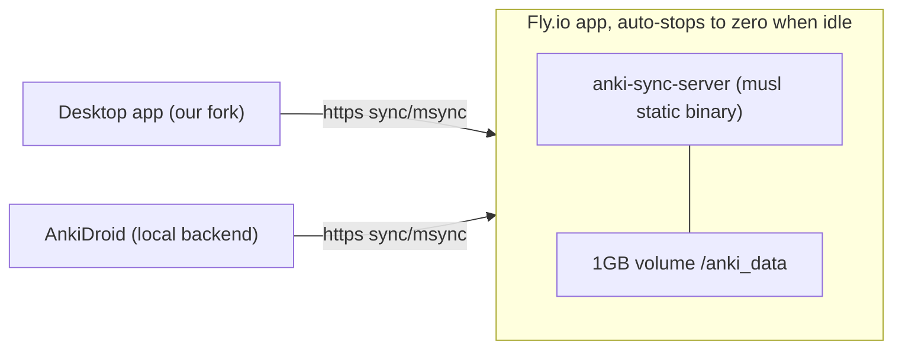

# Speedrun sync (desktop <-> phone) over a self-hosted server on Fly.io

This sets up two-way sync between the **desktop app** and the **AnkiDroid phone
build** using our own copy of Anki's built-in sync server, hosted on Fly.io and
configured to stay **effectively free**.

We host our own server (instead of AnkiWeb) because both clients run our fork's
engine (`anki 26.05b1 + topic_mastery`). Running the matching `anki-sync-server`
binary guarantees the sync protocol versions line up, and keeps your data off a
third party.



## Current deployment (live)

- URL: `https://speedrun-sync-frank-1vls.fly.dev/`
- Username: `frank` (password is stored only as the `SYNC_USER1` Fly secret, not in this repo)
- Region `iad`, one `shared-cpu-1x` / 256 MB machine, 1 GB volume `anki_data`, shared IPv4 `66.241.125.145`, auto-stops to zero when idle.
- Health: `GET https://speedrun-sync-frank-1vls.fly.dev/health` returns `200`.

## What is already done

- The server binary was built from this fork as a static musl executable and
  staged for deployment at
  [anki/docs/syncserver/fly/anki-sync-server](anki/docs/syncserver/fly/anki-sync-server)
  (18.5 MB, `static-pie`, stripped).
- The Fly image + config live in
  [anki/docs/syncserver/fly/](anki/docs/syncserver/fly/):
  [Dockerfile](anki/docs/syncserver/fly/Dockerfile),
  [fly.toml](anki/docs/syncserver/fly/fly.toml),
  [.dockerignore](anki/docs/syncserver/fly/.dockerignore),
  [fly-deploy.ps1](anki/docs/syncserver/fly/fly-deploy.ps1).

The only remaining steps need your Fly account, so they are yours to run.

## Deploy (your steps)

### 1. Install the Fly CLI (once)

```powershell
pwsh -c "iwr https://fly.io/install.ps1 -useb | iex"
```

Then **open a new terminal** so `fly` is on your PATH (or use
`~/.fly/bin/fly.exe`).

### 2. Log in (this is where Fly asks for a card)

```powershell
fly auth login
```

New Fly accounts must add a payment card before they can deploy. That is
unavoidable, but with the settings below the running cost is ~$0 (see
[Keep it free](#keep-it-free) for the honest numbers).

### 3. Deploy with the helper

From the `fly` folder, pick a globally-unique app name and the region closest to
you (`fly platform regions` lists them; e.g. `iad` US-East, `lax` US-West,
`lhr` London, `fra` Frankfurt):

```powershell
cd anki\docs\syncserver\fly
./fly-deploy.ps1 -App speedrun-sync-<you> -Region iad -User <you> -Password "<choose-a-strong-pass>"
```

The script bakes the app/region into `fly.toml`, creates the app and a single
1 GB volume, stores your sync password as a secret, and deploys exactly **one**
machine (`--ha=false`). When it finishes you'll have:

```
https://speedrun-sync-<you>.fly.dev/
```

Verify it's alive (this also wakes a sleeping machine):

```powershell
curl https://speedrun-sync-<you>.fly.dev/health
```

<details>
<summary>Manual equivalent (if you'd rather not use the script)</summary>

```powershell
cd anki\docs\syncserver\fly
# edit fly.toml: set app = "..." and primary_region = "..."
fly apps create speedrun-sync-<you>
fly volumes create anki_data --region iad --size 1 --yes
fly secrets set "SYNC_USER1=<you>:<password>"
fly deploy --ha=false
fly status
```
</details>

## Point the clients at it

Use your **server username/password** (the `SYNC_USER1` value), *not* an AnkiWeb
account. Log out of AnkiWeb on both clients first if you were signed in.

### Desktop (our fork)

1. `Tools > Preferences > Syncing`.
2. In **Self-hosted sync server**, enter: `https://speedrun-sync-<you>.fly.dev/`
   (the engine appends `sync/` and `msync/` automatically).
3. Click **Sync**, log in with your server username/password.
4. The desktop holds the MCAT deck, so when prompted choose **Upload to server**.

### AnkiDroid (phone build)

1. `Settings > Sync > Custom sync server` -> enable it.
2. Set both the **sync URL** and **media sync URL** to
   `https://speedrun-sync-<you>.fly.dev/`.
3. `Settings > Sync > AnkiWeb account` -> log in with the same server
   username/password.
4. Trigger a sync; when prompted choose **Download from server**.

After that initial upload (desktop) + download (phone), syncing is two-way:
review on either device, sync, and the other device catches up.

### Conflict rule (important)

Anki does not auto-merge when both sides changed since the last sync. If you edit
on both devices without syncing in between, the next sync forces a one-directional
choice: **Upload** (keep this device's data, overwrite the server) or **Download**
(take the server's data, overwrite this device). To avoid losing reviews, **sync
right after each study session** so there is never a two-sided divergence.

## Keep it free

Fly is pay-as-you-go (the old always-free allowance is gone for new accounts).
This setup minimizes every billable lever so the bill rounds to ~$0:

| Lever | Setting | Cost effect |
| --- | --- | --- |
| Compute | `shared-cpu-1x` / 256 MB, `auto_stop_machines = "stop"`, `min_machines_running = 0` | Machine sleeps when idle; you're billed only for the seconds it's awake during a sync. Pennies/month. |
| Machines | `fly deploy --ha=false` | One machine, not two. No standby to pay for. |
| Public IP | shared IPv4 (default) | Free. A **dedicated** IPv4 is ~$2/mo, so don't allocate one. |
| Storage | one 1 GB volume | ~$0.15/mo. This is the only real line item. |
| Bandwidth | personal sync traffic | Tiny; well within free egress. |

Honest bottom line: **compute is ~$0**, and the only non-zero charge is roughly
**$0.15/month for the 1 GB volume**. That's not literally $0, but it's the
cheapest a persistent self-hosted server gets. Two ways to handle it:

- Accept the ~$0.15/mo (well under Fly's small-balance handling), or
- Go truly $0 by removing the volume (delete the `[[mounts]]` block and the
  volume). The server's data then lives on the machine's ephemeral disk, which
  survives auto-stop but is wiped on a fresh `fly deploy`. Your decks are never
  lost (the clients are the source of truth) but you'd re-upload from desktop
  after a redeploy. Fine for personal use.

### Watch the cost

```powershell
fly dashboard            # opens billing/usage in the browser
fly machines list        # confirm exactly ONE machine
fly ip list              # confirm shared (no dedicated v4)
```

### Tear it down (stops all charges)

```powershell
fly apps destroy speedrun-sync-<you>
```

## Re-build the server binary (only if the fork's sync code changes)

Inside WSL Ubuntu:

```bash
bash /mnt/c/Users/frank/Documents/Alpha/Speedrun/anki/docs/syncserver/fly/rebuild-server-binary.sh
```

This recompiles the musl binary from the fork and re-stages
`anki/docs/syncserver/fly/anki-sync-server`. Then `fly deploy --ha=false` again.

## Troubleshooting

- **First sync is slow / times out once.** The machine was asleep; Fly cold-starts
  it on the first request. Retry the sync.
- **"Your sync server version is too old/new".** The deployed binary and the
  client engine drifted. Rebuild the binary from the current fork (above) and
  redeploy so both sides are the same version.
- **AnkiDroid won't connect but desktop does.** Re-check that both the sync URL
  and media sync URL are set, and that you used `https://` (Fly forces HTTPS).
- **Lost data on a redeploy.** You're running the no-volume variant. Re-upload
  from the desktop (which has the full collection).
