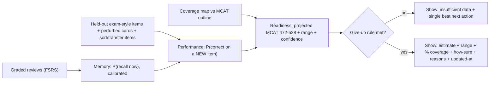
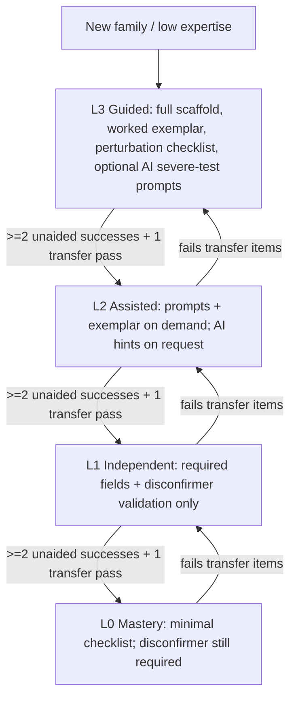
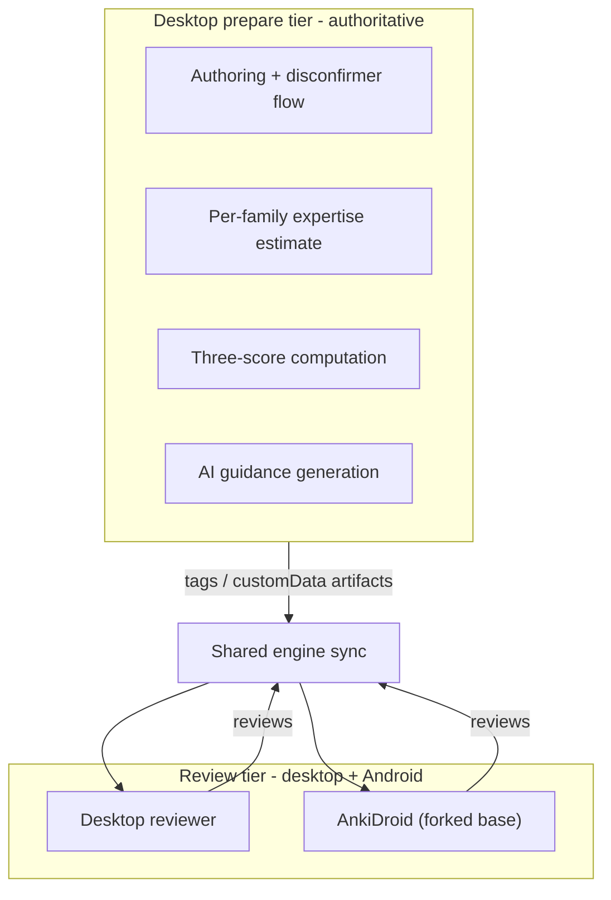
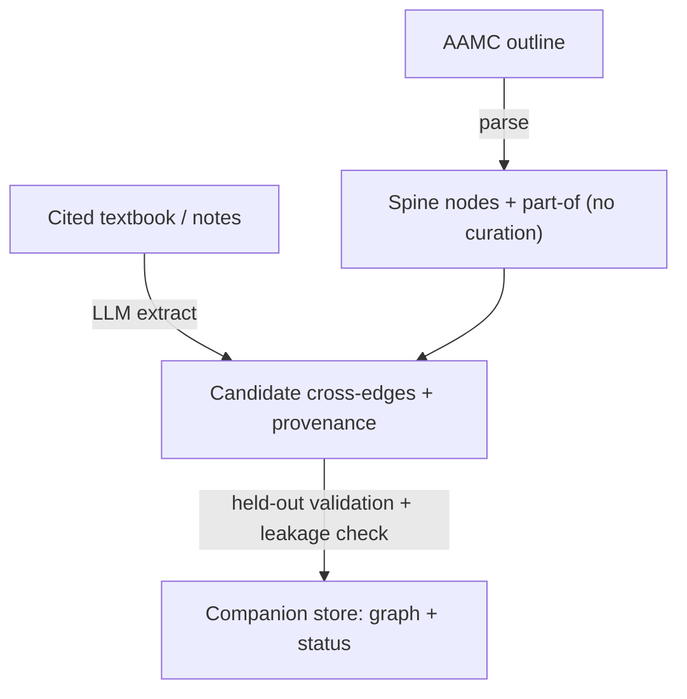

# Speedrun - Product Requirements Document (MVP)

| | |
|---|---|
| Product | Speedrun - a Desktop + Mobile study app built on a fork of Anki |
| Exam | MCAT (total 472-528; four sections each 118-132) |
| Status | Draft |
| Last updated | 2026-06-30 |
| Scope of this PRD | MVP across desktop + mobile (shared engine, two-way sync), with deep focus on two core features |
| Source material | Product spec; `mcat-anki-learning-science-features/brainlift.md`; `mcat-anki-learning-science-features/actions/action-plan.md` |

---

## 1. Summary

Speedrun forks Anki and adds the two things Anki cannot do on its own: it measures whether a student can **use** what they have memorized on new exam-style questions, and it projects an **honest MCAT score** with a range. It runs as a desktop app (the main tool) and a phone companion (review on the go), both on **one shared Rust engine**, with reviews and progress syncing both ways.

The MVP goes deep on **two features** rather than spreading thin:

1. **The three-score honesty system** - three separate scores (Memory, Performance, Readiness), each shown with a range and an evidence bundle, and a hard "give-up rule" that shows no score when the data is insufficient.
2. **Adaptive disconfirmer cards with fading guidance** - a "miss -> card" authoring flow where the student converts a missed question into a card that preserves the deep principle, perturbs the surface, and records a *disconfirmer* ("what one fact would flip this answer?"). The amount of scaffolding **fades** as the student demonstrates per-topic competence, and some guidance levels are **optionally AI-assisted** (hints only, never authoring or grading).

Everything is built on Anki's real Rust engine (a genuine engine change ships to both platforms), and the whole app must run with **AI switched off** and still produce a score.

Both features and all three scores sit on a shared **concept knowledge graph** anchored to the official AAMC content outline - infrastructure (like the Rust engine change), not a third headline feature. It supplies the coverage map, the per-topic score roll-ups, and the readiness "single best next thing to study," and it is the layer the spec rewards for **study planning** when it beats keyword and vector search (spec section 13).

### 1.1 Problem

Remembering "the mitochondria is the powerhouse of the cell" does not mean a student can answer an MCAT passage on cellular respiration. Anki's FSRS already estimates **memory** well, but:

- Students cannot tell whether they can answer a **new, unseen** exam-style question (performance), or what they would actually **score** today (readiness).
- The incumbents are content/practice layers, not honest measurement: AnKing (decks), UWorld (QBank), Jack Westin (CARS). None measures the memory-to-application gap or refuses to show a number it cannot back up.
- Studying happens in two places - at a desk and on a phone between classes - so the tool has to live in both and stay in sync.

### 1.2 Vision / North Star

Tell the student the truth and help them close the gap:

- Three separate, honest numbers - **Memory**, **Performance**, **Readiness** - each with a range, never one blended "78% ready."
- A card-authoring flow that trains **application**, not just recall, by requiring student-authored disconfirmer cards, with scaffolding that fades as the student improves so they finish able to perform **unassisted** (the way the real exam is taken).

### 1.3 Why now / why this is non-redundant

Anki exposes its scheduler/engine via a Rust core shared across desktop and mobile, which makes a true shared-engine fork feasible. The differentiator is not more cards or more questions; it is **honest measurement of the gap** plus a **generation-effect-preserving** authoring loop that the content/QBank incumbents do not provide.

---

## 2. Goals and Non-goals

### 2.1 Goals (MVP)

- **G1 - One engine, two apps:** desktop + phone companion share Anki's Rust engine; reviews and progress sync both ways without loss or double-counting.
- **G2 - Three honest scores:** Memory, Performance, Readiness, each with a range and the full evidence bundle, plus the give-up rule, shown on both apps.
- **G3 - Real Rust change:** a genuine `rslib` change (per-concept-family mastery query) that powers the dashboard and the fading estimator, with tests and undo intact.
- **G4 - Adaptive disconfirmer authoring:** student-authored miss-to-card flow with a required disconfirmer field and fading guidance (template-based core; optional AI hints).
- **G5 - Calibrated memory:** prove the memory model is calibrated on held-out reviews (Brier / log loss + reliability chart).
- **G6 - Performance bridge:** predict held-out exam-style item correctness; run the paraphrase test to prove performance is not just copying memory.
- **G7 - Re-runnable evidence:** held-out splits, a leakage-check script, and the study-feature ablation harness that someone else can re-run.
- **G8 - Degrades gracefully:** both apps run with AI off and still produce a score.
- **G9 - Concept knowledge graph:** an AAMC-outline-anchored concept graph (shared infrastructure) powers the coverage map, the per-topic score roll-ups, and the readiness "what to study next"; its AI-proposed cross-edges are source-traced, held-out-validated, and must beat keyword + vector search (the spec's section-13 study-planning bonus).

### 2.2 Non-goals (MVP)

- Not a content vendor (we do not ship a premade MCAT deck; we improve how students author and measure).
- Not a reimplementation of FSRS (we layer on top of it; memory stays FSRS).
- Not a single blended readiness percentage - blending the three scores is an explicit anti-goal.
- Not an AI card-factory - AI never authors card bodies or grades (see Section 6.4).
- Detailed exclusions in Section 4.2.

---

## 3. Personas

### 3.1 Primary - "Maya," the MCAT premed

- **Context:** junior premed, studying 3-6 months for a test-day deadline. Studies at a desk with the desktop app and on her phone between classes and on transit.
- **Tools today:** AnKing deck, UWorld QBank, AAMC practice material, plain Anki.
- **Behavior / pain:** does thousands of reviews and *feels* prepared, but bombs full-length passages; cannot tell if she is on track; anxious and time-constrained; tends to memorize card wording rather than the underlying principle.
- **Needs:** an honest readiness number with a range and "what to study next"; a way to practice that transfers to new passages; seamless desk-to-phone study.
- **Quote:** "I have 9,000 mature cards and I still don't know if I'm going to hit a 510."
- **Success for Maya:** she sees three honest numbers, trusts them because the evidence is shown, and her authored cards measurably help her on questions she has never seen.

### 3.2 Secondary - "Devin," the high-volume Anki grinder

- **Context:** has 10k+ mature cards, very strong raw recall, plateaued on passage-based reasoning - the exact recognition-not-application trap.
- **Needs:** to *see* the memory-vs-performance gap quantified, and a structured way to convert misses into transfer practice without abandoning his Anki workflow.
- **Quote:** "My recall is perfect. My practice-test scores are not."
- **Success for Devin:** the dashboard exposes his memory/performance gap, and the disconfirmer loop gives him a concrete drill to close it.

### 3.3 Stakeholders (not primary MVP users)

- **Tutors / advisors:** consume readiness honestly (range + confidence) to advise; must not be shown a fabricated number.
- **Curriculum / coverage owners:** care about the coverage map vs the official MCAT outline.

---

## 4. Scope

### 4.1 In scope (MVP)

- Desktop app + phone companion running real review sessions on **one shared Rust engine**; the phone companion is **built on the existing AnkiDroid open-source app (forked, AGPL-3.0)**, not written from scratch.
- A **genuine Rust engine change** (per-concept-family mastery query) shipped to both platforms.
- The **three scores** (Memory, Performance, Readiness) with ranges, the evidence bundle, and the give-up rule - shown on desktop and phone.
- The **coverage map** vs the official MCAT outline, surfaced on the dashboard.
- A **concept knowledge graph** (shared infrastructure): the AAMC-outline spine (imported) plus AI-proposed, source-traced, held-out-validated cross-edges (`prerequisite-of`, `confusable-with`, `shares-deep-principle-with`), built and traversed in the desktop "prepare" tier; it powers coverage, score roll-ups, and study planning.
- **Adaptive disconfirmer authoring** with template-based fading guidance (the no-AI core).
- **Optional AI-assisted guidance** that is degradable, source-traceable, evaluated on a held-out set, and beats a baseline (Section 6.4).
- **Two-way sync** with offline support and a documented conflict rule.
- **Re-runnable evidence:** held-out evaluation, leakage-check script, paraphrase test, and the three-build ablation harness.
- Both apps **run with AI off** and still produce a score.

### 4.2 Out of scope (MVP)

| Excluded | Why |
|---|---|
| CARS as a primary flashcard deck / KPI | AAMC states CARS needs no content knowledge; recall is low-signal (brainlift SPOV 12). A passage module is a future phase. |
| AI authoring card bodies or full decks | Forfeits the generation effect and ships faulty items (anti-pattern #1; BMC "all faulty"). |
| Leaderboards / loss-framed streaks | Depress error-confrontation (anti-pattern #5). |
| Confidence dashboard / confidence-only FSRS changes | Goodhart / illusion-of-competence trap (anti-pattern #7). |
| Exam-date desired-retention ramp | Policy (curve/cap) unspecified - blocked (SPOV 11). Future phase. |
| iOS app entirely (any iOS client, including review) | MVP is Android-first via the AnkiDroid fork; an iOS client adds AGPL vs App-Store friction and has no synced write path. Deferred to a future phase. |
| Validation against real student score histories | The honest "Step 4" bonus needs longitudinal data we cannot gather in MVP; we grade the bridge steps instead. |
| Auto-clustered or unvalidated concept graph; a biomedical-reasoning KG (ROBOKOP/UMLS-style) as the product | Auto-tagged clusters re-import faulty-AI risk (anti-pattern #3); the graph's job is MCAT study planning, not clinical inference. Cross-edges must be source-traced + held-out-validated. |

### 4.3 Phasing note (aligns to the spec's deadlines)

- **Core (no AI):** both apps review the same deck on the shared engine; the Rust change; memory model with range + give-up rule; the **knowledge-graph spine** imported from the AAMC outline driving the coverage map (AI-off); clean-machine install.
- **AI + sync:** AI-assisted guidance added and evaluated; the graph's **AI cross-edges** generated, source-traced, and validated; two-way sync proven; three scores on the phone.
- **Proof:** calibration, performance accuracy, readiness mapping, the ablation result, the **graph-vs-keyword-vs-vector** study-planning benchmark, packaged builds; both run AI-off.

---

## 5. Feature 1 (deep dive): The three-score honesty system

The product shows **three separate scores**, each with a range, plus an evidence bundle, and **refuses to show a number it cannot back up**. Mixing the three into one number is an explicit anti-goal and, per the spec, a fabricated readiness number is an automatic fail.



### 5.1 The three scores defined

**Memory - "can the student recall this fact right now?"**
- Source: Anki's FSRS retrievability R(t) per card; aggregated per topic via the Rust mastery query (Section 9).
- Requirement: **calibrated**. When the model says 80%, observed recall on held-out reviews should be ~80%.
- Evidence produced: a **reliability chart** plus **Brier score** and **log loss** on held-out reviews.

**Performance - "can the student answer a NEW, exam-style question that uses this fact?"**
- Definition: P(correct) on an unseen, exam-style item for a concept/section.
- Inputs: per-topic mastery (mastery query), item difficulty, response timing, and coverage.
- Trained and evaluated on **held-out** exam-style items: the student's perturbed cards, the sort/transfer items (from Feature 2), and a held-out item bank.
- The bridge it must clear: the **paraphrase test** (spec 7d). Take 30 cards; for each write 2 exam-style reworded items; compare card recall vs reworded accuracy. If the two numbers are basically equal, performance is just copying memory - report the gap.

> **Implementation status (built): the Performance lane (SPOV 3 / spec 9.2, 7d, 7e, 7f).** Exam-style items are a native **`Speedrun Performance Item`** note type (interactive multiple-choice; created in the shared Rust engine via `speedrun_ensure_notetypes`, `rslib/src/speedrun/disconfirmer.rs`). Answering is a **card-template MC** that records the pick + latency and guides the grade; the durable, natively-synced outcome is the **review log** grade (a passing grade = correct), so it works on desktop and the AnkiDroid fork. The desktop "prepare" tier fits a **calibrated logistic** P(correct) and runs the **incremental-validity gate** (`pylib/anki/speedrun/performance.py`, exercised by `testdeck/eval_performance.py` and Tools -> "Fit Performance Model", `qt/aqt/speedrun/perf_fit.py`): Performance is only shown once it **beats a recall-only model out-of-sample** and a section has enough graded items - otherwise it abstains, exactly like Memory. The shared dashboard (`rslib/src/speedrun/performance.rs` -> `speedrun_dashboard`) surfaces the per-section accuracy with a Wilson range, **separately gated, never blended** with Memory. AI may *generate* items from a cited source only behind the spec-7f gate (`pylib/anki/speedrun/ai_items.py`: structural check + leakage scan + pre-set cutoff + AI-off fallback; AI never grades). **Honest scoping:** the review grade (not the raw MC pick) is the stored truth; item difficulty is a placeholder until per-item p-values accrue; the 472-528 readiness mapping (9.3) and calibration against real scores (9.4) remain deferred.

**Readiness - "what would the student score today, and how sure are we?"**
- Output: a projected **MCAT total (472-528)** built from per-section scaled scores (118-132).
- Method (documented): map per-section performance + coverage to section scaled scores, then sum; the **range** comes from predictive uncertainty plus coverage gaps; the **confidence** label is driven by coverage and data volume.
- Never a point estimate alone; never a blended percentage.

### 5.2 The honesty rule - the evidence bundle (display spec)

No score is shown without all of:

1. the point estimate,
2. the likely range,
3. the percent of the exam covered so far,
4. a "how sure" indicator (confidence),
5. the time it was last updated,
6. the main reasons behind it,
7. the rule for when it abstains.

Example readiness card (target rendering):

```
Readiness - Projected MCAT 508  (likely 503-512)
Confidence: LOW - only 42% of topics studied
Updated: 2 min ago
Top reasons: strong Bio/Biochem mastery; thin Psych/Soc coverage; few timed items
Best next step: study "Amino acid properties" (high-yield, low coverage)
Abstains when: < 200 graded reviews OR < 50% coverage
```

### 5.3 The give-up rule (stated thresholds)

The app shows **no score** when it lacks data, and states the line explicitly:

- **Readiness:** no score until **>= 200 graded reviews AND >= 50% MCAT-outline coverage**.
- **Section score:** no section score until **>= 40 graded items in that section**.
- **Performance (per concept):** no concept-level performance estimate until **>= 8 graded exam-style attempts** in that concept.
- When abstaining, show "insufficient data" plus the **single best next thing to study**, chosen by **knowledge-graph traversal** (Section 8): the highest-yield, lowest-coverage, weakest node, constrained by `prerequisite-of` so a prerequisite is recommended before the topic that needs it.

(These thresholds are the MVP defaults; they are tunable and are stated in-product and in the model description.)

### 5.4 Coverage map (spec 7c)

- Enumerate every topic on the **official MCAT outline**; mark which ones the student's deck actually covers; show **percent covered** on the dashboard, per section and overall.
- The outline is the **knowledge-graph spine** (Section 8); coverage is computed from `tests` edges (card -> concept) mapped onto spine nodes, rolled up along `part-of` per section and overall.
- If coverage is below the line, the app **abstains** from readiness. A 10,000-card deck that skips a high-weight section must never show "ready."

### 5.5 Acceptance criteria

- AC1: No readiness/section/performance score renders unless its give-up threshold is met; otherwise the abstain state + best-next-action renders.
- AC2: Every shown score renders all seven evidence-bundle elements.
- AC3: Memory calibration is reported on a held-out set (reliability chart + Brier + log loss).
- AC4: The paraphrase-test gap (card recall vs reworded accuracy on 30 cards x 2 items) is computed and reported.
- AC5: Readiness is always a range on the 472-528 scale with a confidence label; no blended single percentage exists anywhere in the UI.
- AC6: Coverage percent (overall + per section), computed from card->concept edges over the knowledge-graph spine, is shown and drives the abstain decision.
- AC7: The same three scores with ranges render on the phone (Section 7).
- AC8: The "single best next thing to study" is produced by knowledge-graph traversal (yield x weakness, prerequisite-constrained), not a flat sort.

---

## 6. Feature 2 (deep dive): Adaptive disconfirmer cards with fading guidance

> **Implementation status (built):** the `Speedrun Disconfirmer` note type, the guided Miss->Card authoring dialog (Tools -> Add Disconfirmer Card) with disconfirmer validation, and the per-concept-family fading ladder are implemented natively in the fork (`pylib/anki/speedrun/disconfirmer.py` + `fading.py`; GUI in `qt/aqt/speedrun/`). Review uses **active retrieval** - the card front asks "what one fact would flip this answer?". An original, labeled `[Sample]` MCAT deck and a seeded disconfirmer deck ship for testing (`pylib/anki/speedrun/sample_content.py` + `seeding.py`); no copyrighted decks are bundled (licensing).

> **Re-scope to brainlift v3-focused + all features on by default:** v3-focused keeps three features (two-tier, per-family fading, pretest-first); the **native pretest-first card mode (Section 6.7, SPOV 13) is the spec section-8 study feature**. All learning features now run **in the study loop, on by default** (not behind a Tools tab): the pretest cards review natively, fading updates on every review, the in-review disconfirmer fires on a miss (`speedrun_review.enabled=true`), and AI card-type gating/hints are enabled with a deterministic fallback (Section 6.4). The remaining direction is to re-host the disconfirmer authoring as a card-template flow (no Qt modal); tracked, deferred.

The disconfirmer remains the application-authoring feature (student converts a missed question into a card that **preserves the deep principle, perturbs the surface, and records a disconfirmer**; the student always authors the body - the generation effect). The **amount of scaffolding fades** with a per-concept-family expertise estimate (Section 6.3).

### 6.1 The card model (note type)

Fields:

- **Provenance / QID** - e.g. `uworld:NNNNN` tag or the student's own reference (never a stored copyrighted stem).
- **Student's principle** - the underlying idea in the student's words.
- **Original cover-story -> Swapped cover-story** - the surface context, original and a student-made variant (both stored, to prove a real perturbation).
- **Trap flag** - the lure/misconception that caught them.
- **Disconfirmer (required)** - "what one fact would flip this answer?"
- **Boundary case** - an edge case against the stated principle.

### 6.2 The authoring flow

1. Student logs a miss (paste a QID or type their own write-up; no copyrighted stem stored).
2. The flow prompts for the **principle**, a **surface perturbation** (original -> swapped cover-story), the **trap**, and the **disconfirmer**.
3. **Disconfirmer validation** runs (Section 6.5).
4. The card is created on the **desktop "prepare" tier** (authoring is desktop-side per the two-tier architecture) and syncs to all clients for review.

### 6.3 The fading guidance ladder

Scaffolding level is chosen per **concept-family** - a node in the concept knowledge graph (Section 8) - from an expertise estimate (driven by the Rust mastery query, Section 9). Fading follows the expertise-reversal evidence: heavy support helps novices but *hurts* experts, so support must fade - and **return** if the student regresses.



Guidance content per level (the no-AI core is template-based):

| Level | When | Guidance shown |
|---|---|---|
| **L3 Guided** | new family / low expertise | full field-by-field scaffold; a worked exemplar of a good disconfirmer; a surface-perturbation checklist (cover-story, entities, units, values, framing, representation); optional AI **severe-test prompt** suggestions |
| **L2 Assisted** | improving | prompts and exemplar available on demand (hint button); optional AI hints **only when requested** |
| **L1 Independent** | competent | required fields + disconfirmer validation only; no exemplar; no AI by default |
| **L0 Mastery** | mastered family | minimal checklist; disconfirmer still required |

- **Advance** a level after **>= 2 unaided successes + 1 transfer-item pass** in that family.
- **Reinstate support on any miss** (tightened to the brainlift, `fading.record_review`): the moment the learner slips - any Again, not only a transfer failure - the counters reset and the rung regresses one step. The estimator is treated as the *tested* component, so it is conservative.
- **Conservative initial estimate:** `estimate_rung` is capped at L1 and **never seeds L0 from recall alone** (per-family mastery estimates over-predict); L0 (mastery) is reachable only by demonstrated advancement.
- **Driven by real study-card reviews:** fading updates from MCAT-tagged study cards per concept-family (`qt/aqt/speedrun/state.py` `record_answer`), not only disconfirmer reviews.
- **Declarative excluded at the item level:** rote items are detected per card by the deterministic `heuristic_classify` and skipped (SPOV 10 scopes fading away from declarative recall); disconfirmer cards are always treated as application.
- **Syncable artifact (SPOV 4):** the resulting per-family rung is written back as a `speedrun_rung::Lx` **tag** on the reviewed note, so the cross-platform review tier can read it without desktop logic.
- **Graph-driven inputs:** the concept-family is a knowledge-graph node (Section 8); transfer/perturbation items are selected via `shares-deep-principle-with` edges (deep-structure variants) and `confusable-with` edges (discrimination drills), so fading decisions and severe tests are sourced from the graph, not ad hoc.

### 6.4 The AI guidance lane (optional, constrained, degradable)

> **Implementation status (built):** the AI lane lives in `pylib/anki/speedrun/` (`ai.py`, `cardtype.py`, `ai_eval.py`, `anticrutch.py`) with desktop wiring in `qt/aqt/speedrun/`. AI (1) **decides whether a missed card even warrants a disconfirmer** - on a *first* miss, declarative facts are skipped and only application/reasoning misses prompt (a card the student keeps missing always prompts regardless of type; see 6.3) - and (2) offers a **source-cited hint** for writing one (never the disconfirmer itself, never grading). It ships with the required discipline: an **AI-off deterministic fallback** (heuristic classifier + template hint), per-output **provenance**, a **held-out eval** ("Run AI Eval") that must beat the heuristic baseline at a pre-registered cutoff, a **leakage check**, and the **assisted-vs-unassisted anti-crutch kill-switch**. Provider is OpenAI-compatible; the key is read from env `SPEEDRUN_AI_KEY` or a profile-local file (never synced). **On by default and in the study loop:** the AI lane is enabled by default and card-type classification runs **automatically in the background when a deck is opened** (cached per card via a tag), so the in-review disconfirmer gating and cited hints work as part of studying with no manual Tools step. With **no API key** the client resolves to None and every AI op falls back to its deterministic path (heuristic classifier / template hint), so the app still runs fully AI-off per the spec. The manual Tools actions ("Classify Card Types", "Run AI Eval", "AI Settings") remain.

AI is allowed in exactly one lane and is never required:

- **AI may:** generate guidance *prompts*, severe-test questions, and candidate boundary cases **against a human-authored key**.
- **AI may not:** write the card front/back, write the disconfirmer, or grade the student's answer/explanation (anti-pattern #1 and #6).
- **Traceable:** every AI output cites a named source (the concept's human key / reference).
- **Evaluated before students see it:** accuracy + wrong-rate on a **held-out** set with a cutoff fixed *before* looking at results; AI guidance must **beat a template-prompt baseline**; run the leakage check.
- **AI-off fallback:** with AI disabled, guidance uses **template prompts**, so the feature (and the whole app) fully works AI-off.
- **Anti-crutch kill-switch:** because guidance fades to unassisted, the **primary metric is unassisted performance**. If the AI-assisted cohort shows assisted-up / **unassisted-down >= 5 pp** vs the template/no-AI cohort, the AI level is **disabled** (the crutch signature; Bastani PNAS -17% unassisted is the cautionary anchor).

### 6.5 Disconfirmer validation

- Reject blank disconfirmers and ones that merely restate the answer (heuristic: non-empty; not an answer restatement; optional embedding-similarity ceiling).
- The check is a **nudge, not an authoritative grader** - the student can override with a confirmation.

### 6.6 Acceptance criteria

- AC1: A miss can be turned into a card with all fields in under ~30s; no copyrighted stem is stored.
- AC2: The disconfirmer field is required and validated (blank / answer-restating is rejected with a revise prompt; override allowed).
- AC3: Guidance level is selected per concept-family from the expertise estimate; it advances on >= 2 unaided + 1 transfer pass and regresses on transfer failure.
- AC4: Declarative-recall families do not receive the ladder.
- AC5: With AI off, full template-based guidance is available and a card can be authored end-to-end.
- AC6: Every AI guidance output shows its source; AI never populates the card body or the disconfirmer.
- AC7: The anti-crutch monitor computes unassisted performance and disables the AI level if the >= 5 pp crutch signature appears.
- AC8: The three builds for the ablation (full / feature-off / plain Anki) are switchable behind a flag for the section-8 test.

### 6.7 Pretest-first first-exposure mode (SPOV 13) - the section-8 study feature

> **Implementation status (built):** a native `Speedrun Pretest` note type (`pylib/anki/speedrun/pretest.py`) delivers first-exposure material as a forced **guess -> reveal -> mandatory feedback** card using Anki's native type-in field (`{{type:Answer}}`). The whole experience lives in the **card template** (the cross-platform review tier) - no desktop modal - so it renders on stock desktop and any review client (SPOV 4). A `[Sample]` pretest deck is seeded (`sample_content.py` `PRETEST_SEED`, `seeding.py` `seed_pretest_deck`). No AI.

This is the brainlift v3-focused "pretest-first" position and the spec's **section-8 study feature** (replacing the disconfirmer in that role). Pretesting (errorful generation) before instruction produces an item-specific encoding benefit, but **only with corrective feedback** - so the back always reveals the answer plus an `Explanation`. The benefit is banked to the **specific item** by default (no claimed topic spillover); free-recall typed answers avoid the proximate-lure trap (multiple-choice variants deferred). The mode is **default-on**, because learners systematically undervalue it (the metacognitive illusion).

**Hypothesis (stated up front, for the ablation):** "Introducing new cards via a forced guess + in-session feedback raises delayed accuracy on those specific items at equal study time, versus seeing the same cards study-first." Failure condition: the pretest build does not beat the feature-off build on delayed unseen-style items at equal time, or the benefit only appears on non-pretested items in the same topic.

- **Ablation toggle (spec 8):** `speedrun_pretest_enabled` (collection config, default true; Tools -> "Pretest-first mode"). When **on**, first-exposure content is the type-in pretest card; when **off**, the same content seeds as plain Basic (the feature-off arm). Plain unmodified Anki is the third build.
- **Honest scoping:** efficacy is presented as a **bet** to be settled by a volume-matched, equal-time RCT with a mandatory test-after-study comparator - never as a measured result (the observational ceiling).

#### 6.7.1 Acceptance criteria

- AC-P1: A new card forces a typed guess before reveal, and the reveal always shows the correct answer plus the `Explanation` feedback.
- AC-P2: The experience is template-only (renders via `{{type:Answer}}`); no desktop modal is involved, so it works on any review client.
- AC-P3: With the toggle off, the same content seeds as plain Basic cards, giving the section-8 feature-off build.
- AC-P4: The mode is on by default and runs fully AI-off.

---

## 7. Mobile companion and two-way sync

The phone is a companion for reviewing on the go and checking readiness; it is not a separate project. It shares the same cards, progress, and engine, and it syncs.

**Platform base (build on AnkiDroid):** the Android companion is **built on the existing AnkiDroid open-source codebase (AGPL-3.0)** - we fork AnkiDroid rather than write a client from scratch. We add Speedrun's review-tier template JS (the three-score displays and the disconfirmer review UI) and the sync path, and we reuse AnkiDroid's existing integration with Anki's shared Rust backend (Kotlin + JNI over `rsdroid` / `rslib`). This keeps the engine genuinely shared - our Rust mastery query (Section 9) ships to the phone - and avoids reimplementing the scheduler (which would not count per the spec). **The MVP companion is Android-only; iOS (any iOS client, including review) is out of scope and deferred to a future phase (Section 4.2).**

### 7.1 Two-tier architecture (the load-bearing constraint)

The one code-verified architecture fact: stock Anki custom-scheduling JavaScript sees only `{deck_name, seed, decay, desired_retention}`, runs at answer-time, and **cannot reorder the due queue** by concept. Therefore all concept-aware work is **desktop-prepared**, and the review tier is template JS that runs on stock clients.



*(iOS is out of scope for the MVP - see Section 4.2 - so no iOS client appears in the review tier.)*

- **Desktop "prepare"** owns authoring, the expertise estimate, score computation, and AI prompt generation; it is the **authoritative writer** (desktop reconcile).
- **Review tier** is template JS on the desktop reviewer and the AnkiDroid fork (iOS out of scope); small state rides in tags / `customData` (<= 100 bytes).
- The mastery-query Rust change is in the shared engine, so it runs on the phone build too.

### 7.2 What the phone must do

- Run **real review sessions** on the same deck via the shared engine.
- Show the **three scores with ranges** and follow the **give-up rule** (identical to desktop).
- Work **offline**, then sync when the connection returns.
- Sync **both ways**: a review on the phone shows on the desktop and vice versa, with no lost or double-counted reviews.

### 7.3 Sync and conflict handling

- **Two-way sync** of reviews and progress (Anki's existing sync or a self-hosted sync server).
- **Offline-then-sync:** reviews queue locally and reconcile on reconnect.
- **Conflict rule (documented):** if the same card is reviewed on two devices offline, the **later review timestamp wins** for scheduling state, and the **revlog keeps both review events** (so counts are correct and nothing is silently dropped). This rule is stated in-product and in the docs.
- **Authoritative writes:** webview-captured state (sort result, guidance level, confidence) is reconciled **desktop-side**; mobile-at-answer writes are an Android-only optimization. (iOS is out of scope for the MVP - Section 4.2.)

### 7.4 The sync test (spec 7b) - acceptance

- Review **10 cards on the phone offline** and **10 different cards on the desktop**; reconnect; **all 20 land once** - none lost, none double-counted.
- Then review the **same card on both devices offline**, sync, and show the conflict rule picks a clear, correct winner (and the revlog retains both events).
- AC: zero lost, zero double-counted; conflict winner is deterministic and documented; offline review fully functional then converges on reconnect.

---

## 8. The concept knowledge graph (shared infrastructure)

The coverage map, the per-topic score roll-ups, the mastery query (Section 9), and the fading expertise estimate (Section 6.3) all need one shared answer to "what concept is this card, what is it part of, and what is it related to." That shared answer is a **concept knowledge graph**. It is infrastructure - like the Rust engine change - **not a third headline feature**, and it resolves the concept-family-taxonomy open question (Section 12.4). It also unlocks the spec's section-13 bonus: graph-based **study planning** that beats keyword and vector search.

No ready-made MCAT study graph exists (the closest public graphs - ROBOKOP, RTX, and Fecho et al. 2021 - are biomedical *reasoning* graphs used only to test on MCAT questions, the wrong shape), so the spine is imported from an authoritative source and the cross-edges are generated under the project's AI discipline.

### 8.1 Data model

**Nodes**
- **Spine (from the AAMC outline):** `Section` (4) -> `Foundational Concept` (10) -> `Content Category` (~30, e.g. 6A) -> `Topic / concept-family` (a few hundred). The concept-family is the leaf granularity the mastery query and fading use.
- **Card / item** nodes (the student's deck and authored items), mapped onto concept nodes.
- **Misconception / trap** nodes (optional), sourced from Feature 2's trap flag and disconfirmers.

**Edges**
- `part-of` (hierarchy) - imported from the AAMC outline (ground truth).
- `tests` (card -> concept) - AI-classified onto the fixed node list; drives the coverage map.
- `prerequisite-of` - AI-proposed; orders study planning / next-best.
- `confusable-with` - AI-proposed; powers discrimination drills (Feature 2 / brainlift SPOV 3).
- `shares-deep-principle-with` - AI-proposed; powers deep-structure transfer items (brainlift SPOV 2).
- Every AI-proposed edge stores **provenance** (the cited source span) and a **validation status**.

### 8.2 Sources (use existing material; do not invent)

- **AAMC "What's on the MCAT Exam?" content outline** - the authoritative spine (the same outline the coverage map already requires).
- **A cited textbook / the student's own notes** - the grounding corpus for cross-edges (GraphRAG), so each edge traces to a named source.
- **Optional seed:** UMLS / MeSH parent-child and typed relations for the bio/biochem slice (note the UMLS license; partial coverage only).

### 8.3 Two-layer build (agent-built, compliant)



- **Layer 1 - spine (zero curation):** parse the AAMC outline into nodes + `part-of`. This is ground truth, not auto-clustering, so it does not trip anti-pattern #3.
- **Layer 2 - cross-edges (validated):** an LLM (via the Neo4j LLM Knowledge Graph Builder or LangChain `LLMGraphTransformer`) proposes typed edges **only from the cited corpus**; each edge carries provenance. Edges are **dropped unless** they pass a small **held-out, human-checked sample** (reuse the gold set, Section 11.2) and the leakage check (spec 7e).

### 8.4 Architecture and storage (two-tier, per Section 7)

- The graph **lives and is traversed in the desktop "prepare" tier** (it sees the whole collection); the review tier never traverses it on-device (anti-pattern #2).
- **Storage:** the spine hierarchy rides the existing **tag namespace** (`#mcat::6A::...`); cross-edges exceed the tag tree and the 100-byte `customData` cap, so the canonical graph lives in a **companion store** (lightweight SQLite/JSON + `networkx` traversal; Neo4j only as an optional extraction tool). Traversal **results** (next-best topic, `tt` / confusable flags) sync to the review tier as tags / `customData`.
- **AI-off:** the spine + coverage map + tag-based next-best work without AI; AI only adds the cross-edges (graceful degrade, goals G8 / G9).

### 8.5 Study-planning evaluation (the spec's section-13 win condition)

- **Task:** recommend the next N topics / retrieve the missing prerequisite for a given student state.
- **Arms:** **graph traversal** vs **keyword search** vs **vector / embedding similarity** (`text-embedding-3-small`).
- **Pre-registered, held-out metric:** the recommendation predicts accuracy gain on unseen downstream items, or recall@k against a human-authored "correct prerequisite" key; report point + range + nulls.
- **Bar:** the graph must **beat both baselines** - "the graph alone is not the win; showing it helps is the win."

### 8.6 Acceptance criteria

- AC1: The spine imports from the AAMC outline into nodes + `part-of`; the coverage map is computed over it.
- AC2: Every AI-proposed edge stores a named-source provenance and a validation status; unvalidated edges never feed readiness.
- AC3: Cross-edges pass a held-out, human-checked sample and the leakage check before use.
- AC4: Graph traversal produces the "single best next thing to study" (prerequisite-constrained).
- AC5: The study-planning benchmark reports graph vs keyword vs vector on a held-out metric with a range.
- AC6: With AI off, the spine + coverage + tag-based next-best still function.

---

## 9. The Rust engine change (per-concept-family mastery query)

The spec requires a genuine change inside Anki's Rust engine, not just the Python screens. The MVP's change is a **per-concept-family mastery query** in `rslib` - chosen because it directly powers both deep features: the dashboard's three scores and the fading expertise estimate. Because the engine is shared, the change ships to desktop and phone. The concept-families it aggregates over are **nodes in the concept knowledge graph (Section 8)**, and roll-ups follow the graph's `part-of` edges (with optional prerequisite-weighting for readiness).

### 9.1 What it does

A backend call that returns, **per topic / concept-family**:

- number of cards **mastered** (e.g. retrievability above a threshold and/or maturity),
- **average recall**,
- **transfer-pass count** (held-out sort/transfer items passed),

fast enough to power the dashboard on **50,000 cards**.

### 9.2 How it is exposed

- A new **protobuf message + service method** (in `proto/`), implemented in `rslib/`, exposed to Python via the `rsbridge` PyO3 boundary, and called from `pylib/anki`.
- Consumed by the desktop "prepare" tier for scores (Section 5) and by the expertise estimate that drives fading (Section 6.3).

### 9.3 Must-haves (spec 7a)

- **>= 3 Rust unit tests** + **1 test that calls it from Python**.
- Proof that **undo still works** and the **collection does not corrupt**.
- A one-page note on **why this belongs in Rust, not Python** (it aggregates over the whole collection at dashboard latency on 50k cards; doing it in Python would miss the speed targets and duplicate engine logic).
- A list of the **upstream files touched** and an assessment of **future-merge difficulty**.
- Confirmed to still work on the **phone build**.

### 9.4 Genuineness note (important)

The `extract_custom_data` SQLite search/column **already exists in mainline** (`has-cd:` / `prop:cdn:` already parse), so building it is a near-no-op and does **not** satisfy the "genuine engine change" requirement. The mastery query is new aggregation logic and counts. (Alternative of equal weight, if preferred later: a **points-at-stake review queue** that orders due cards by topic-weight x student-weakness via a new protobuf message.)

### 9.5 Acceptance criteria

- AC1: The query returns per-topic mastered count, average recall, and transfer-pass count.
- AC2: On the shared 50k-card deck it meets the dashboard speed targets (Section 11).
- AC3: >= 3 Rust unit tests + 1 Python-calling test pass; undo and collection-integrity tests pass.
- AC4: The change runs on the phone build.
- AC5: The "why Rust" note and the touched-files / merge-difficulty list exist.

---

## 10. User stories by epic

### Epic A - Three honest scores

- **A1:** As Maya, I want to see Memory, Performance, and Readiness as three separate numbers with ranges, so that I am not misled by a single blended figure. *AC:* three distinct score cards, each with a range; no blended percentage exists.
- **A2:** As Maya, I want every score to show its evidence (range, coverage, confidence, reasons, updated-at, abstain rule), so that I can trust it. *AC:* the seven-element bundle renders on each score.
- **A3:** As Maya, I want the app to refuse a readiness number when it lacks data and tell me what to study next, so that I get honesty plus direction. *AC:* below threshold -> abstain state + best-next-action.
- **A4:** As Devin, I want to see my Memory-vs-Performance gap, so that I know recall alone is not enough. *AC:* the paraphrase-test gap is visible/reported.

### Epic B - Disconfirmer card authoring

- **B1:** As Maya, I want to turn a missed question into a card that captures the principle, a perturbed surface, and a disconfirmer, so that I train application, not wording. *AC:* card model fields saved; disconfirmer required + validated.
- **B2:** As Maya, I want the app to reject a disconfirmer that just restates the answer, so that the field stays meaningful. *AC:* blank/restating rejected with revise prompt; override allowed.
- **B3:** As a careful user, I want my own write-ups only (never copyrighted stems) stored, so that I stay within ToS. *AC:* no copyrighted stem stored; QID/own-text only.

### Epic C - Fading + AI guidance

- **C1:** As a novice in a topic, I want heavy scaffolding (exemplar, checklist, prompts), so that I can author a good card. *AC:* L3 guidance shows for low-expertise families.
- **C2:** As I improve, I want guidance to fade so I author independently, so that I end up able to perform unassisted. *AC:* level advances on >= 2 unaided + 1 transfer pass; regresses on transfer failure.
- **C3:** As an AI-assisted user, I want optional hint prompts sourced from a key, so that I get help without the AI doing the work. *AC:* AI suggests prompts only, cites a source, never writes body/disconfirmer/grade.
- **C4:** As an offline/AI-off user, I want full template-based guidance, so that the feature still works. *AC:* AI-off path authors a card end-to-end.

### Epic D - Mobile + sync

- **D1:** As Maya, I want to review on my phone between classes and see it on my desktop later, so that my study is unified. *AC:* phone reviews appear on desktop after sync.
- **D2:** As Maya, I want offline review that syncs on reconnect with nothing lost or doubled, so that flaky connections do not corrupt my progress. *AC:* the 7b test passes (0 lost, 0 double-counted).
- **D3:** As Maya, I want the three scores with ranges and the give-up rule on my phone too, so that readiness is consistent across devices. *AC:* identical score behavior on phone.

### Epic E - Dashboard + Rust mastery query

- **E1:** As Maya, I want a dashboard that loads fast and shows per-topic mastery + coverage, so that I can plan study. *AC:* dashboard meets the speed targets on 50k cards.
- **E2:** As a developer, I want the mastery data computed in the shared Rust engine, so that desktop and phone share one fast source of truth. *AC:* the Rust query (Section 9) backs the dashboard and the fading estimate.

### Epic F - Concept graph and study planning

- **F1:** As Maya, I want my coverage and "what to study next" to come from a concept graph anchored to the official MCAT outline, so that recommendations respect prerequisites. *AC:* next-best is produced by prerequisite-constrained graph traversal (Section 8).
- **F2:** As a developer, I want AI-proposed edges to be source-traced and held-out-validated before they affect any score, so that the graph stays honest. *AC:* unvalidated edges never feed readiness; each edge cites a source.
- **F3:** As a skeptic, I want the graph's study planning benchmarked against keyword and vector search, so that we only claim it helps if it does. *AC:* graph vs keyword vs vector reported on a held-out metric with a range.

---

## 11. Success metrics and evaluation plan

### 11.1 Headline metrics

| Area | Metric | Target / bar |
|---|---|---|
| Memory honesty | Calibration on held-out reviews (Brier, log loss) + reliability chart | Well-calibrated; reported, not asserted |
| Performance bridge | Accuracy on held-out exam-style items | Beats a memory-only baseline |
| Performance != memory | Paraphrase-test gap (card recall vs reworded accuracy, 30 cards x 2) | Gap reported; meaningfully > 0 |
| Learning feature | Section-8 ablation: full vs feature-off vs plain Anki, equal study time, unseen items | Pre-registered primary metric; report range + nulls |
| Anti-crutch | Unassisted performance trend as guidance fades; AI vs template | No assisted-up / unassisted-down >= 5 pp |
| Disconfirmer quality | % cards with valid (non-restating) disconfirmers | Reported; high |
| Sync | Lost / double-counted reviews in 7b | 0 / 0 |
| Coverage honesty | Abstains correctly below the give-up thresholds | 100% of below-threshold cases abstain |
| Safety | Leakage check result; AI source-traceability; AI-off score | Clean; 100% traceable; score produced AI-off |
| Study planning (graph) | Graph vs keyword vs vector on next-best / prerequisite retrieval (held-out) | Pre-registered primary; graph beats both baselines; report range + nulls |
| Coverage mapping | Card->concept classification accuracy vs a held-out hand-labeled sample | Reported; high |
| Graph-edge quality | AI-edge precision on the held-out human-checked sample; leakage-check result | Precision reported; leakage clean |

### 11.2 Evaluation plan (re-runnable)

- **Held-out splits** for memory calibration and performance accuracy; a setup someone else can re-run to the same result.
- **Leakage check (7e):** a script that scans training data for any test item or near-copy; result must be clean (leaked data zeroes that score).
- **Paraphrase test (7d):** 30 cards x 2 reworded items; report the memory-vs-performance gap.
- **Ablation (section 8):** three builds (full / feature-off / plain Anki), same learners, same questions, same time budget; state the main number ahead of time; report a range and report nulls.
- **AI card/guidance check (7f-style):** a gold set of Q&A pairs; AI guidance outputs run through a checker; report correct-and-useful / wrong / correct-but-bad; pass cutoff set before looking; block failures.
- **Crash + offline (7g):** kill each app mid-review 20x -> zero corrupted collections; pull the network -> AI turns off cleanly while both apps keep working and still give a score.
- **One-command benchmark (7h):** a single command loads the shared 50k-card deck and prints p50 / p95 / worst for each action below.
- **Study-planning benchmark (spec 13):** graph traversal vs keyword vs vector on a held-out next-best / prerequisite-retrieval task; pre-register the primary metric; report a range and nulls. AI-edge validation reuses the gold Q&A set as the human-checked sample, and the leakage check (7e) covers the edge-grounding corpus.

### 11.3 Speed and reliability targets (spec section 10)

Report p50, p95, and worst case on the shared deck:

| Action | Target |
|---|---|
| Button press acknowledged | p95 < 50 ms (desktop and phone) |
| Next card after grading | p95 < 100 ms |
| Dashboard first load | p95 < 1 s |
| Dashboard refresh | p95 < 500 ms, no screen freeze |
| Sync of a normal session | < 5 s on a normal connection |
| Cold start | < 5 s desktop / < 4 s phone |
| Any UI freeze | never > 100 ms |
| Crash test | 0 corrupted collections on both platforms |
| Memory on 50k cards | under a stated limit on desktop and a mid-range phone |

---

## 12. Risks, dependencies, assumptions, open questions

### 12.1 Risks and mitigations

| Risk | Why it bites | Mitigation |
|---|---|---|
| **Crutch effect** - AI help raises assisted but lowers unassisted performance | The exam is taken unassisted (Bastani PNAS -17%) | Guidance **fades** to unassisted by design; unassisted performance is the primary metric; >= 5 pp crutch signature disables the AI level |
| **Observational ceiling** - feature->MCAT-gain link is not proven | The Anki<->exam literature is non-randomized; the one applied anchor (Wothe Step-2-CK) is null | Frame efficacy as a **bet** with a volume-matched RCT on unseen items as the resolver; never present accuracy/streaks as proof of learning |
| **Leaked test data** | Inflates scores; zeroes that score per the spec | Leakage-check script (7e) + disjoint held-out splits |
| **ToS (AAMC/UWorld)** | Storing copyrighted stems risks account closure | Student-authored content only; QID tags + own write-ups; never store stems |
| **AGPL section 13 / sync infra** | Self-hosted modified-engine sync triggers source-offer + makes us data controller | Use Anki's sync or keep the modified engine behind a boundary / publish source; legal-review gate before shipping a self-hosted server |
| **Mobile write constraints** | AnkiDroid review tier is JS-only (no Python) | Desktop reconcile is authoritative; Android uses the JS get/set-tags channel; iOS is out of scope for the MVP |
| **AI reliability / prompt injection** | LLM medical items can be faulty; retrieved text can carry attacks | Human key decides; provenance + isolation; AI-off path always available |
| **Single blended number creeps in** | Automatic fail per the spec | Architectural rule: three scores never blend; UI lint/review |
| **Auto-clustered / faulty AI edges** | A wrong prerequisite/confusable edge yields a confidently wrong recommendation (anti-pattern #3) | Authoritative spine + source-grounded edges + held-out validation; unvalidated edges never feed readiness |
| **UMLS licensing / scope** | A UMLS seed needs a license and only covers the bio slice | Treat UMLS as optional; the AAMC spine + textbook grounding are the primary sources |
| **Companion-store cost / graph staleness** | Cross-edges live outside the tag/customData channels and can drift from the deck | Lightweight SQLite/JSON store; re-validate edges when the deck or source changes |

### 12.2 Dependencies

- Anki's Rust engine (`rslib`), `rsbridge`/PyO3, protobuf boundary, and FSRS (layered on, not reimplemented).
- **AnkiDroid** (open-source, AGPL-3.0) as the Android companion base, plus its `rsdroid`/JNI bridge to the shared Rust engine.
- The shared 50k-card reference deck for benchmarks.
- The official MCAT outline for the coverage map **and the knowledge-graph spine**.
- A gold Q&A set for the AI guidance check (it doubles as the held-out edge-validation sample).
- (If AI on) an LLM provider + a data-processing agreement before any covered data is sent.
- A **cited grounding corpus** (textbook / notes) for the graph's AI cross-edges.
- A **companion store** (SQLite/JSON) + `networkx` for the canonical graph and traversal; (optional) UMLS/MeSH seed; embeddings (`text-embedding-3-small`) for the vector baseline.

### 12.3 Assumptions

- Students bring their own deck/content (we measure and improve authoring; we do not ship a premade deck).
- Concept-families / topic tags come from the concept knowledge graph (Section 8) - the AAMC-outline spine plus card->concept mapping (needed for mastery, coverage, and fading).
- The desktop is the primary authoring device; the phone is review + readiness.

### 12.4 Open questions

- **Readiness mapping:** exact method to turn per-section performance + coverage into 472-528 with a defensible range (and whether any real practice-test data is available to calibrate it - the bonus Step 4).
- **AI model + cost:** which model for guidance generation, and the per-student cost envelope.
- **Sync transport:** self-hosted `anki-sync-server` vs requesting AnkiWeb permission vs an APKG demo transport - gated on the legal review.
- **Fade thresholds:** confirm/tune the ">= 2 unaided + 1 transfer" advance rule and the regression trigger against pilot data.
- **Concept-family taxonomy (resolved):** the topic graph is the **AAMC-outline-anchored concept knowledge graph** (Section 8); mastery, coverage, and fading all read its nodes.
- **Edge generation:** which model/provider and grounding corpus for the AI cross-edges, and the precision cutoff fixed before validation.
- **Graph store:** lightweight SQLite/JSON + `networkx` vs Neo4j for the canonical graph.
- **UMLS use:** whether to seed the bio/biochem slice from UMLS/MeSH given its license.

---

*This PRD is intentionally narrow: two features built in depth (honest three-score measurement and adaptive disconfirmer authoring with fading guidance) on a real shared-engine Anki fork, rather than a broad feature net. It encodes the spec's hard rules (three separate scores with ranges, the give-up rule, AI-off operation, a genuine Rust change, two-way sync) and the brainlift's validated positions (two-tier architecture, generation-effect authoring, support-fading, the AI anti-crutch lane).*
