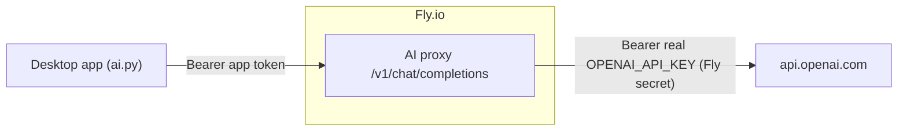

# Speedrun AI proxy

A tiny OpenAI-compatible reverse proxy so the **real OpenAI key never ships in the app**.
The desktop client calls this proxy with a **revocable app token**; the proxy holds the
real key as a server secret and forwards requests to OpenAI.



Why a proxy: a key baked into a client binary/wheel/APK can always be extracted. A proxy
keeps the real key off the device entirely; the client only holds an app token that is
**revocable, rate-limited, and restricted to an allowlisted model**, so a leak is
contained (rotate the token, redeploy) rather than a stolen OpenAI key.

## What it does

- `POST /v1/chat/completions` - requires `Authorization: Bearer <SPEEDRUN_PROXY_TOKEN>`,
  restricts `model` to `ALLOWED_MODELS`, rate-limits per IP, then forwards to OpenAI with
  the real key and returns the response unchanged. It is OpenAI-compatible, so the client
  only had to change its `base_url` + token.
- `GET /health` - `200 ok` once the key + token are configured.

## Deploy (your step - needs your Fly account + OpenAI key)

```powershell
cd anki\docs\aiproxy
# pick a globally-unique app name + region; edit fly.toml's `app`/`primary_region` to match
fly apps create speedrun-ai-<you>
# secrets (never in the repo): the real key, and an app token you generate
fly secrets set OPENAI_API_KEY="sk-..." SPEEDRUN_PROXY_TOKEN="<generate-a-long-random-token>"
fly deploy --ha=false
fly status
curl https://speedrun-ai-<you>.fly.dev/health   # -> ok
```

Generate a strong app token, e.g. `python -c "import secrets; print(secrets.token_urlsafe(32))"`.

## Wire it into the client

No secret is baked into source. Provide the proxy URL + app token at runtime, either via
env vars:

- `SPEEDRUN_PROXY_URL = "https://speedrun-ai-<you>.fly.dev/v1"`
- `SPEEDRUN_PROXY_TOKEN = "<the SPEEDRUN_PROXY_TOKEN you set above>"`

or via a gitignored local config file `speedrun-ai.local.json` (searched from the working
directory and repo root), for local and demo builds:

```json
{
  "proxy_url": "https://speedrun-ai-<you>.fly.dev/v1",
  "proxy_token": "<the SPEEDRUN_PROXY_TOKEN you set above>"
}
```

With nothing set the app runs with AI off (deterministic fallback). `SPEEDRUN_AI_KEY` (a
real OpenAI key, via env, an `openai_key` entry in the local file, or the first line of a
gitignored `api-key` file) still overrides for local development and talks to OpenAI
directly.

## Rotate / revoke the app token

If the app token leaks, rotate it without touching the real key:

```powershell
fly secrets set SPEEDRUN_PROXY_TOKEN="<new-token>"
```

Then set the new token via env (`SPEEDRUN_PROXY_TOKEN`) or the local config file - nothing
to rebuild, since it is no longer baked into source. The old token stops working
immediately.

## Cost

Same profile as the sync server: one `shared-cpu-1x` / 256 MB machine that auto-stops to
zero when idle, shared IPv4, no volume -> effectively ~$0 for personal use (you pay only
for the seconds it is awake serving a call, plus your OpenAI usage).
