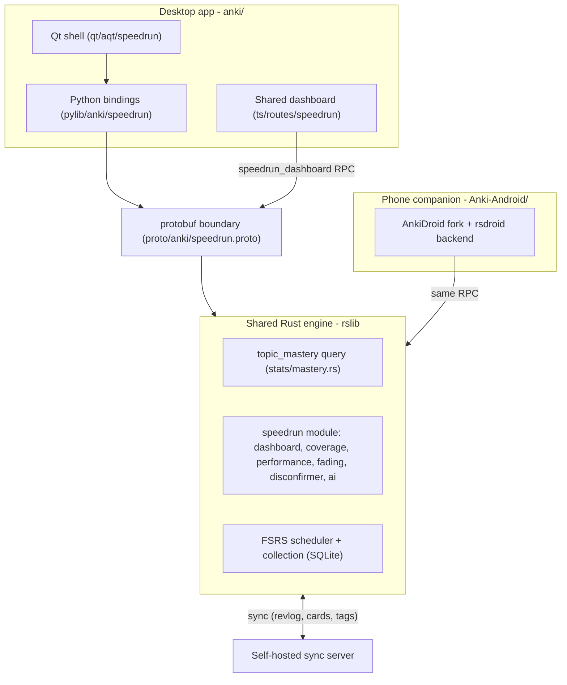
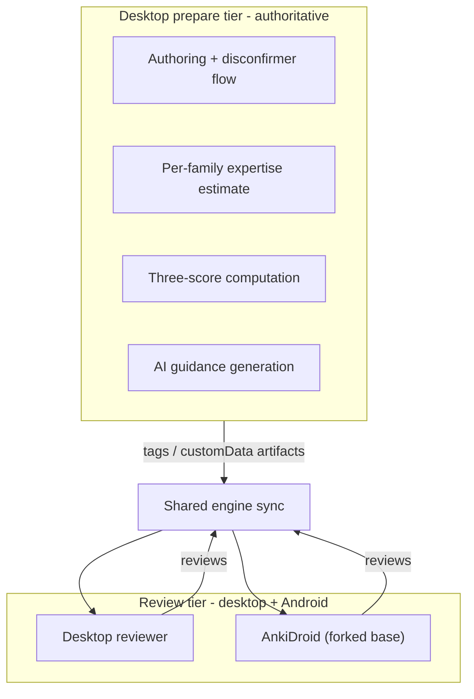

# Speedrun architecture

How the pieces fit together. Speedrun is a fork of Anki that adds an MCAT study app with
three separately-reported scores on top of Anki's shared Rust engine. This document is the
map; deeper writeups are linked at the end.

## One engine, two apps

Both apps run the **same** Rust engine (`rslib`). The desktop app is a fork of Anki; the
phone companion is a fork of AnkiDroid (`../../Anki-Android/`) that loads the same engine via
a locally built `rsdroid` backend. Reviews and progress sync between them through a
self-hosted `anki-sync-server` (see [../../SYNC.md](../../SYNC.md)).

The genuine engine change (spec 7a) is the read-only per-topic **`topic_mastery`** query in
[../rslib/src/stats/mastery.rs](../rslib/src/stats/mastery.rs). It aggregates, per topic tag,
card counts and the mean FSRS recall in one SQL pass using the engine-internal
`extract_fsrs_retrievability` scalar, fast enough to power the dashboard on 50,000 cards. It
lives in the shared engine, so it ships to the phone for free. Full rationale, tests, and the
files-touched list: [rust-change-topic-mastery.md](rust-change-topic-mastery.md).

## Two-tier design (the load-bearing constraint)

Stock Anki custom-scheduling JavaScript sees only `{deck_name, seed, decay,
desired_retention}` at answer time and cannot reorder the due queue by concept. So all
concept-aware work is **desktop-prepared** (authoritative), and the **review tier** is what
runs on every client.

State that must reach the phone rides in **tags** (e.g. `speedrun_rung::Lx`) or small
`customData` (<= 100 bytes), so the cross-platform review tier reads it without desktop logic.
(iOS is out of scope for the MVP, so no iOS client appears here.)

## The three scores (never blended)

All three come from the engine and are read by the shared Svelte dashboard
([../ts/routes/speedrun/+page.svelte](../ts/routes/speedrun/+page.svelte)) via the
`speedrun_dashboard` RPC. Each has an explicit give-up rule (see
[model-descriptions.md](model-descriptions.md)):

- **Memory** - mean FSRS recall per content category, rolled up per section, with a 95% Wilson
  range. Abstains for buckets with no reviewed cards.
- **Performance** - a calibrated logistic P(correct) on held-out exam-style items
  ([../rslib/src/speedrun/performance.rs](../rslib/src/speedrun/performance.rs)). Gated: shown
  only after it beats a recall-only model out-of-sample and a section has >= 5 graded items.
- **Readiness** - the per-section performance mapped onto the MCAT 472-528 scale (method in
  [score-mapping.md](score-mapping.md)). Computed only above the give-up line (default: >= 50%
  coverage and >= 200 reviews); otherwise it abstains and states why.

Coverage (spec 7c) rolls the AAMC outline ([../rslib/src/speedrun/outline.rs](../rslib/src/speedrun/outline.rs))
up per section, and the dashboard now also reports each individual topic as covered or not.

## The AI lane (assistive, gated, off-path)

AI never writes cards, never grades, and never touches the three scores; with AI off, every
step falls back to a deterministic path and the app still scores. It runs through a hosted
proxy that holds the OpenAI key server-side. All untrusted source text passes through
`sanitize_source` (mirrored in [../rslib/src/speedrun/ai.rs](../rslib/src/speedrun/ai.rs) and
[../pylib/anki/speedrun/textutil.py](../pylib/anki/speedrun/textutil.py)) and is framed as
untrusted DATA. The card-type classifier is trusted only after it clears a pre-registered
held-out cutoff and beats the keyword baseline. Details + eval: [ai-lane.md](ai-lane.md).

## Evidence pipeline

Every reported number is generated. The harnesses in [../testdeck/](../testdeck/) each write a
self-describing JSON artifact into [eval-artifacts/](eval-artifacts/), and
[../testdeck/build_report.py](../testdeck/build_report.py) renders them into
[eval-results.md](eval-results.md). Run with `just eval`, `just bench`, `just crash-test`, and
`just sync-test`.

## Where things live

| Area | Path |
| --- | --- |
| Shared engine (Speedrun) | `rslib/src/speedrun/`, `rslib/src/stats/mastery.rs` |
| Protobuf boundary | `proto/anki/speedrun.proto`, `proto/anki/stats.proto` |
| Python bindings | `pylib/anki/speedrun/` |
| Qt desktop UI | `qt/aqt/speedrun/` |
| Shared dashboard (Svelte) | `ts/routes/speedrun/+page.svelte` |
| Eval harnesses + artifacts | `testdeck/`, `docs/eval-artifacts/` |
| Mobile app | `../../Anki-Android/` (AnkiDroid fork) |

## Related docs

- [SPEEDRUN.md](../SPEEDRUN.md) - overview, status, repository layout, license.
- [PRD.md](../PRD.md) - full product requirements (sections 5-11).
- [rust-change-topic-mastery.md](rust-change-topic-mastery.md) - the engine change (7a).
- [files-touched.md](files-touched.md) - upstream files modified + merge risk.
- [model-descriptions.md](model-descriptions.md) - the three models + give-up rules.
- [score-mapping.md](score-mapping.md) - readiness mapping method.
- [ai-lane.md](ai-lane.md) - the AI lane and its eval.
- [../../SYNC.md](../../SYNC.md) - two-way sync + conflict handling.
