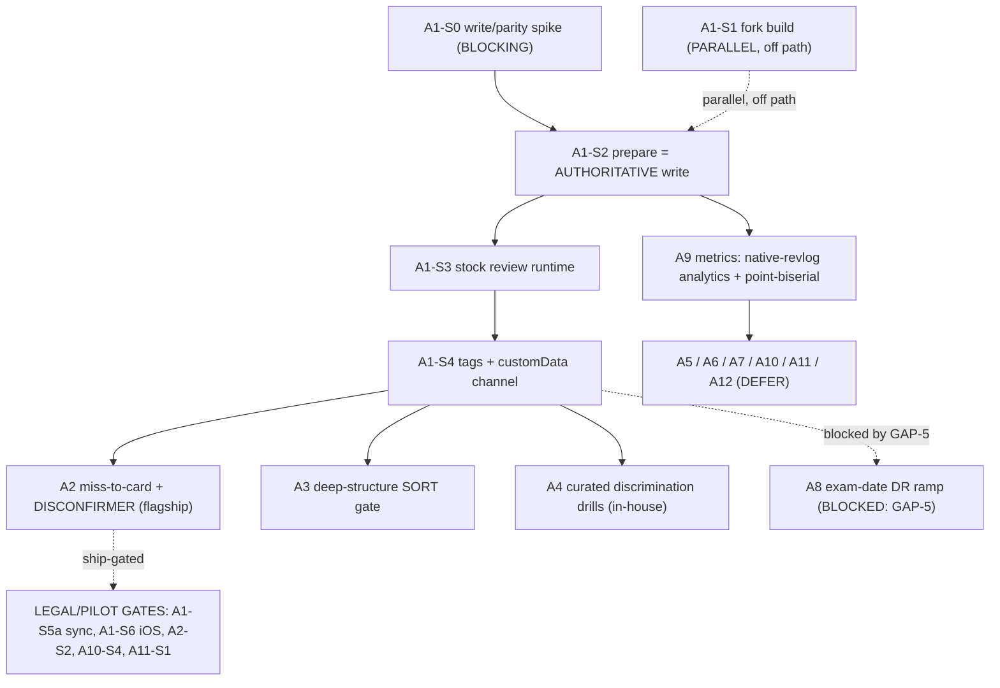

# Execution Plan: MCAT Anki Fork — Learning-Science Features

## Owners

**Autonomous multi-agent create-actions system.** Role roster (cross-family, isolated, decorrelated):

- **3 action researchers** — `action-researcher-methods` (Claude Sonnet), `action-researcher-resources` (GPT), `action-researcher-constraints` (Claude Sonnet).
- **`citation-checker`** (Claude Sonnet) — shared with the BrainLift pipeline; verified implementation facts (Step 1b) and the binding constraints vs primary sources (Test 3).
- **`action-planner`** (Claude Opus) — decomposed A1–A12 into concrete steps.
- **`action-skeptic`** (Claude Sonnet), **`action-red-teamer`** (GPT, decorrelated from the Opus planner), and **2 action domain-experts** — `action-domain-expert-operator` (Claude Sonnet) + `action-domain-expert-finance-compliance` (GPT).
- **`feasibility-tester` ×2 families** (GPT + Claude) — Test 1 cold-concreteness screen.
- **`action-editor`** (Claude Sonnet) — this document.

**Source:** `brainlifts/mcat-anki-learning-science-features/brainlift.md` (12 feature SPOVs: 1 Validated / 3 Strong / 8 Weak). Sibling run `mcat-anki-study-app` (scoring/honesty) is out of scope here.

**Integrity checks run.** Cross-family isolation (no critic saw another's draft); the Test-2 binding-constraint adversary (`action-red-teamer`, GPT) ran on a different family than the `action-planner` (Claude Opus), agent-to-agent, never relayed back for a thumbs-up; Test-1 feasibility-testers spanned GPT + Claude. **The one-per-run decoy was CAUGHT** — a deliberately infeasible step dressed as concrete ("TF.js MiniLM in the card webview re-ranks the due queue + writes synced queue order"; reintroduces anti-pattern #2) scored 2/10 (GPT) and 1/10 (Claude) cold, FAILED Test 2 ("no binding constraint — a wish"), and was INFEASIBLE vs primary source (custom-scheduling JS mutates the current card only; the queue is built backend-side; AnkiMobile has no review-screen synced write). The gate tracks feasibility, not polish.

---

## Purpose

**North Star.** Turn the BrainLift's feature SPOVs into ONE concrete, sequenced, feasibility-tested build plan for a small team forking Anki (one shared Rust engine, AGPL, MCAT) — so the team knows *exactly which learning-science features to add, where each physically runs on Anki's real substrate, and in what order*. The plan executes:

- **SPOV 4 (Validated) — the two-tier architecture** = the load-bearing foundation. Every concept-aware feature is **desktop "prepare" → cross-platform "review"** because live on-device semantic queue re-ranking through stock Anki is code-verified impossible. All of A1 builds this; everything else rides on it.
- **SPOV 1 (flagship) — the student-authored "miss → card" scaffold with a required DISCONFIRMER field** (A2). No AI auto-authoring of the body.
- **SPOV 2 — the deep-structure SORT gate** that unlocks "transfer-trained" status on held-out items (A3).
- **SPOV 3 — a curated library of human-reviewed discrimination drills** for known MCAT confusable sets (A4).
- **SPOV 5 — the falsifiable-metrics layer** (item discrimination + a PFL proxy) that refuses accuracy/streaks as evidence of learning (A9).
- Deferred but planned: **SPOV 10** support-fading (A5), **SPOV 6** MC feedback + error-classification (A6), **SPOV 7** confidence → high-confidence-wrong router (A7), **SPOV 11** exam-date DR ramp (A8), **SPOV 9** AI severe-test generator + crutch kill-switch (A10), **SPOV 12** CARS product decision (A11), **SPOV 8** non-distorting motivation (A12).

**This plan respects every anti-pattern the BrainLift rejected** (no AI card-body authoring; no on-device queue re-rank; no auto-tagged clusters; no global hard-mode; no leaderboards/loss-streaks; no AI-as-authoritative-grader; no confidence dashboard / confidence-only FSRS change; no accuracy/streaks as evidence; no CARS deck/KPI; no cram override; no re-adding Anki built-ins as "features"; the "AI deck + FSRS is all you need" decoy). They are injected as hard guardrails and called out per step.

### In Scope
- The two-tier engine substrate (fork build, desktop-prepare script, stock-client review-tier JS, syncable-artifact channel, sync/transport, AGPL packaging).
- The flagship student-authored miss→card + disconfirmer feature and its ingestion/perturbation/validation.
- The deep-structure sort gate, curated discrimination drills, and the falsifiable-metrics layer.
- The deferred feature set (support-fading, MC feedback engine, confidence router, exam-date DR ramp, AI severe-test lane, CARS decision, non-distorting motivation), planned with feasibility tiers.
- The corrected cost reality and the legal-review quote gate that blocks *shipping* (not building) sync / ingestion / AI / CARS-content.

### Out of Scope
- The three-score honesty/readiness architecture (sibling run `mcat-anki-study-app`).
- The fixed project rules themselves (fork Anki; shared Rust engine; AGPL; MCAT) — givens.
- Final production UI design and pricing; non-MCAT exams (used only as out-of-distribution reach checks in the BrainLift).
- Relitigating the SPOVs or the rejected anti-patterns — already settled upstream.

### Readiness-tier legend
- **Ready** — Test 1 pass (concrete) · Test 2 real binding constraint + dependencies/estimates hold · Test 3 FEASIBLE-CONFIRMED. Execute now.
- **Plausible** — feasible and buildable; *efficacy* pends a pilot/measurement (Test 3 FEASIBLE-PLAUSIBLE), or the step shares the content/feature efficacy-pending pattern and was not separately gate-confirmed. Build it; prove it with the named experiment.
- **Risky** — a binding constraint is contested or efficacy is weak; kept ONLY with a named mitigation + a decision gate.
- **Needs-Decision** — feasible, but rests on a human input the plan cannot resolve (a genuine build-vs-buy fork or a legal/BD gate).
- **BLOCKED** — a load-bearing action with NO execution-ready step until a gap closes. Not invented around; the exact gate and unblocker are named.

---

## Execution Plan

Grouped **Action (A1–A12) → Work-stream → Phase**. Roles: **R** = Rust/build eng · **P** = Python/data eng · **J** = card-template/JS eng · **C** = MCAT content author/reviewer · **L** = PM/legal/BD. **Costs as-of 2026-06-29.**

---

### A1 — Two-tier foundation (Validated SPOV 4) — FOUNDATION

**Work-stream: the engine substrate everything rides on.** *Phase: MVP critical path = A1-S0 → A1-S2 → A1-S3 → A1-S4. A1-S1 runs PARALLEL and OFF the critical path. A1-S5/S6/S7 are pilot/legal-gated.*

**A1-S0 (Ready):** Run the client write-back / parity spike — empirically confirm, per target client+version, what review-tier card-JS can PERSIST into the *synced* collection BEFORE any WRITE step is built.
- How: on the team's target AnkiDroid + AnkiMobile + desktop versions, test three channels: (1) **AnkiDroid `AnkiDroidJS` get/set tags** (#17795; requires `new AnkiDroidJS({version,developer})` + user-enabled JS API; some calls open a dialog) — the only community-blessed synced write from the review flow; (2) `states.current.customData` **set-before-answer** (AnkiDroid #14865 historically broken — re-test, never assume); (3) confirm **AnkiMobile has NO synced write** (only `sessionStorage` front→back / device-local `localStorage`, resets on update).
- Resources: $0; 1×J; 0.5–1 day.
- Dependencies: none (runs on STOCK clients).
- Acceptance criteria: a written matrix `{client × version × channel → persists? syncs?}` + a per-feature go/no-go. Until a channel passes, A3-S4 / A4-S3 / A6-S3 / A7-S1 / A9-S1 default to desktop-reconcile.
- Binding constraint + mitigation: the matrix must be *empirical on target versions* (assumptions here are how the whole review tier silently breaks). Mitigation = test-before-build; iOS = none, Android = tags/version-contingent, desktop = authoritative. No on-device queue re-rank (anti-pattern #2).
- Feasibility: T1 7.5 (specific APIs + matrix deliverable); T2 binding constraint = "the synced-write matrix must be empirically verified per version" (PASS); T3 FEASIBLE-CONFIRMED (resolves GAP-2/3 in principle).

**A1-S1 (Ready — build only):** Fork & build Anki from source; rename; land the project's genuine real-`rslib` change (selection deferred — see Open decisions).
- How: clone `ankitects/anki` to a **space-free path** (the workspace path "AI Brainlifts" has a space → the build dies); build on **WSL/Linux/Mac, NOT Windows/PowerShell**; pinned Rustup + uv + N2/Ninja + `just`; `./run` builds rslib+rsbridge (PyO3); `tools/build` → wheels. Own name + logo (the Anki name is trademarked; the logo is AGPL). **AnkiDroid-from-source is CUT from the MVP** (the review tier runs on the stock app, AI-Hints precedent).
- Resources: $0 (AGPL); 1×R; 0.5–1 day for the renamed-fork build.
- Dependencies: none; runs parallel to the review-tier critical path.
- Acceptance criteria: the **renamed fork launches and opens a collection** (`just run` / `./run` green on a Linux box). "CI-reproducible" is dropped from the MVP bar.
- Binding constraint + mitigation: space-free Linux path + pinned toolchain (mitigates the #1 build failure). **CORRECTION baked in:** the previously-named "mandatory real Rust change" — a SQLite search/column over `extract_custom_data(card.data,'key')` — **already exists in mainline** (`rslib/src/storage/sqlite.rs` registers the scalar fn; `has-cd:` / `prop:cdn:` already parse in `rslib/src/search/parser.rs`), so building it is a near-no-op and does **NOT** satisfy the project's "make a genuine engine change" requirement. The fork BUILD stays Ready; the genuine real-Rust-change is escalated to an **Open decision** (lead candidate = A8-S2b's customData-targeting native per-card-DR write — real rslib work that preserves stock sync).
- Alternatives (the real-Rust-change — recommended first): **(a, recommended)** A8-S2b customData-targeting native per-card-DR write (genuine rslib/protobuf/migration work that keeps stock-client + AnkiWeb sync); **(b)** another novel scheduler/storage surface not already upstream; **(c)** ~~`extract_custom_data` search~~ — REJECTED as the genuine change (already mainline). See Open decisions.
- Feasibility: T1 7.0 (repo + change named); T2 WEAK (a first-from-scratch fork build in 0.5–1 day is optimistic — buffer it); T3 FEASIBLE-CONFIRMED for the build, with the premise-wobble correction above on the "real change."

**A1-S2 (Ready):** Build the desktop "prepare" tier as a LOCAL single-collection script — the AUTHORITATIVE write path for ALL review-tier-captured state.
- How: Python over `pylib/anki` and/or AnkiConnect (`POST localhost:8765`: findNotes / notesInfo / addNote / updateNoteFields / updateNoteTags / setSpecificValueOfCard / changeDeck / setDueDate). **AnkiConnect is an HTTP server INSIDE a running Qt GUI** (not offline/cron) → run against a live desktop profile; headless = **xvfb**. The value captured in the review webview (sort result, confidence) is NOT a scheduling-transform input → it MUST be reconciled desktop-side.
- Resources: $0 (AnkiConnect GPLv3, `git.sr.ht/~foosoft/anki-connect`); 1×P; 1–1.5 days.
- Dependencies: A1-S0. (Does NOT depend on the fork — runs on stock desktop.)
- Acceptance criteria: writes field/tag/customData that appear on a 2nd device AND is **idempotent, resumable, paginated** (50k-card collections OOM otherwise), takes a **backup before prepare**, and writes only when clients are **quiesced** (single-writer `with_col`; third-party writes during unsynced changes → forced full-sync / lose-changes); ships a **scratch test profile** (field/template edits = schema-modifying = forced full sync) + a **schema-stability guard** (abort on drift).
- Binding constraint + mitigation: write-backs must survive sync under the single-writer lock → mitigation = idempotent/resumable/paginated/backup-first/quiesced discipline; runs OFF the answer path (anti-pattern #2 avoided).
- Feasibility: T1 7.0 (interface + quality gates stated); T2 WEAK (production-safe backup/resume/pagination is optimistic — the acceptance criteria *are* the mitigation); T3 FEASIBLE-CONFIRMED. Consolidated **Ready**.

**A1-S3 (Ready):** Build the cross-platform "review" tier runtime as card-template JS on STOCK clients.
- How: template `<script>` JS only (proven cross-client by AI-Hints' unified UI script on **stock** AnkiDroid/AnkiMobile/AnkiWeb with no add-on, no fork build); reserve `card_will_show` + `pycmd` + Python for desktop-only. Persistence of anything captured here follows the A1-S0 matrix (default: desktop reconcile).
- Resources: $0; 1×J; 1–2 days.
- Dependencies: A1-S0.
- Acceptance criteria: one note type renders an interactive card identically on **stock** desktop / AnkiDroid / AnkiMobile.
- Binding constraint + mitigation: mobile = JS-only + capture-local → anything needing a synced write routes to A1-S2 (the desktop-reconcile rule is the mitigation).
- Feasibility: T1 7.0 (cross-client reveal-on-tap); T2 binding constraint = "the same template JS must render+interact on all three stock clients" (PASS); T3 FEASIBLE-CONFIRMED.

**A1-S4 (Ready):** Build the syncable-artifact channel (tiny customData flags + tag namespaces; companion store later).
- How: **(a)** tiny `customData` flags (key `"cd"`, ≤8-byte keys / ≤100-byte total; `{"tt":1}`, `{"dr":92}`) — **written by desktop reconcile** (answer-time write is the Android-only, version-contingent optimization); **(b)** tag namespaces (`#confusable::inhibition::competitive`; AnKing-style `#AK_MCAT_v2::…`; syncs natively, dodges the 100-byte cap; the AnkiDroidJS get/set-tags channel from A1-S0 is the only review-flow synced write on Android); **(c)** companion store for big artifacts.
- Resources: (a)/(b) $0; (c) $6–15/mo; 1×R/P; 1 day.
- Dependencies: A1-S0, A1-S2; (a)'s native read uses an `extract_custom_data` search (already upstream — fine to *consume*).
- Acceptance criteria: a >100-byte artifact (a small sort set) round-trips desktop→stock mobile via **tags**; customData flags round-trip via **desktop reconcile**.
- Binding constraint + mitigation: never exceed `validate_custom_data` (silent truncation) → mitigation = tags are the durable cross-client channel; customData is for ≤100-byte flags only.
- Alternatives (the artifact channel — recommended (a)+(b) for MVP): **(a, recommended) tiny customData flags** for ≤100-byte state; **(b, recommended) tag namespaces** for anything larger / cross-client durability; **(c)** companion store (AnkiHub-style) for big artifacts, later (its cost is $6–15/mo + ops; tag-list bloat is (b)'s cost, silent truncation is (a)'s).
- Feasibility: T1 4.5 (low only because it sequences after the A1-S0 matrix — resolved by ordering); T2 binding constraint = "artifacts must round-trip within `validate_custom_data` limits / via tags" (PASS); T3 FEASIBLE-CONFIRMED. Consolidated **Ready** (sequence after A1-S0).

**A1-S5 (Needs-Decision):** Choose the sync/transport path; version the schema. *(MVP ships only (c) APKG as demo transport.)*
- How: see Alternatives.
- Resources: (a) DO $6–12/mo + ops + [legal: §13 + GDPR controller]; (b) $0 + [legal: written permission]; (c) $0.
- Dependencies: A1-S2, A1-S4.
- Acceptance criteria: for the MVP, (c) two devices transport custom fields/tags via APKG **for a demo** (dup / scheduling-loss acknowledged); true convergence requires (a).
- Binding constraint + mitigation: AnkiWeb ToS forbids third-party clients without written permission, and APKG round-trip is NOT convergence → mitigation = use (c) only as labeled demo transport; (a) for any real pilot, behind the legal-review quote gate.
- Alternatives (the sync path — recommended (c) for MVP/demo, (a) for pilot): **(a) self-host `anki-sync-server`** (HTTP-only → add TLS; "individual/family" scope; multi-tenant auth/scaling = your burden) — triggers **AGPL §13** network-use source-offer AND makes you the **GDPR data controller**; **(b) request written Ankitects permission for AnkiWeb** (do NOT budget AnkiWeb as a programmable backend); **(c, recommended for MVP) APKG import/export as "portable demo export/import" ONLY** — does NOT cleanly preserve scheduling/customData and can duplicate on GUID collision.
- Feasibility: not separately gate-scored; rests on a human input (the §13+GDPR sync decision) → Needs-Decision. The (c) demo path is FEASIBLE-CONFIRMED as *demo transport*, not convergence.

**A1-S6 (Needs-Decision) [DEFER]:** Choose the iOS review-tier path.
- How: see Alternatives. iOS has **NO synced write path** (A1-S0/GAP-3) → any gated feature on iOS is capture-local / practice-only until a desktop reconcile runs.
- Resources: Apple $99/yr only if (b).
- Dependencies: A1-S0, A1-S3, A1-S5.
- Acceptance criteria: a fork card renders + is interactive on stock AnkiMobile via template JS; gated-feature state on iOS stays local (no synced unlock until a desktop reconcile runs).
- Binding constraint + mitigation: AGPL §7-vs-Apple-Usage-Rules conflict (VLC / GNU-Go were pulled) → NEVER ship an own engine-bearing iOS app; mitigation = path (a) inside stock AnkiMobile + Android-first.
- Alternatives (the iOS path — recommended (a)+(c)): **(a, recommended) review tier = card-template JS inside the EXISTING AnkiMobile** (legal workaround; iOS writes nothing synced); **(c, recommended) defer iOS, go Android-first** (Play permits AGPL; AnkiDroid Kotlin+JNI rslib-bridge); **(b)** a 100%-own thin client to a server (no AGPL engine on-device) — only if you must.
- Feasibility: not separately gate-scored; rests on a human input (the iOS/legal fork) → Needs-Decision.

**A1-S7 (Plausible):** Handle AGPL packaging, the §13 boundary, and naming.
- How: publish modified source (AGPL-3.0-or-later); any modified-engine server (sync / prepare / LLM gateway) offers source per §13 OR sits behind a non-AGPL API boundary; own name/mark.
- Resources: 1×L ~0.5 day + [legal].
- Dependencies: A1-S1.
- Acceptance criteria: the repo builds from published source; §13-compliant; own name/logo.
- Binding constraint + mitigation: §13 network-use is triggered by A1-S5(a) self-hosted sync → mitigation = keep the modified engine behind an API boundary or publish the server source; the §13 trigger is gated on the A1-S5a decision.
- Feasibility: the publish-source + naming baseline is concrete (≈Ready); the §13 boundary pends the A1-S5a sync decision → carried **Plausible** to avoid claiming a tier the gate did not confirm.

---

### A2 — Student-authored miss→card scaffold + DISCONFIRMER (SPOV 1) — FLAGSHIP

**Work-stream: the flagship card feature.** *Phase: MVP.*

**A2-S1 (Ready):** Build the "Miss→Card" note type with a required DISCONFIRMER field, and decide the disconfirmer's *use*.
- How: fields = Provenance/QID, Student's principle, **Original cover-story → Swapped cover-story**, Trap-flag, **Disconfirmer: what one fact flips this?**, Boundary-case; renders all clients via A1-S3. Disconfirmer-use decision + DoD: **MVP = passive back-display** (disconfirmer shown on the answer side); **ROADMAP = active-retrieval front-prompt** ("what one fact would flip this?" → student answers → reveal).
- Resources: $0; 1×J; 0.5 day.
- Dependencies: A1-S3 (authored on desktop via A1-S2).
- Acceptance criteria: all fields save; MVP DoD = the disconfirmer renders on the back across stock clients; the active-retrieval front variant is logged for post-MVP.
- Binding constraint + mitigation: the student authors the body (generation effect) → mitigation = NO AI auto-authoring (anti-pattern #1).
- Feasibility: T1 8.0 (all fields named, testable); T2 binding constraint = "every required field, including the disconfirmer, persists and renders cross-client" (PASS); T3 FEASIBLE-CONFIRMED. (Feature *efficacy* — the disconfirmer-specific transfer delta — is the SPOV 1 pilot, not a feasibility blocker.)

**A2-S2 (Ready — build; ship gated on legal):** Build miss ingestion.
- How: see Alternatives. Stores only the student's OWN write-up. NEVER screenshots of UWorld/AAMC (ToS auto-closes the account).
- Resources: (a)/(b) $0; (c) ~$0.45–1.20 / 300pp.
- Dependencies: A1-S2.
- Acceptance criteria: a miss logged from a QID/paste in <30s; no copyrighted stem stored.
- Binding constraint + mitigation: AAMC/UWorld ToS = student-authored content ONLY → mitigation = QID tag-lookup + the student's own write-up; obtain the legal-review quote before shipping ingestion (see Cost reality / Open decisions).
- Alternatives (miss ingestion — recommended (a)+(b)): **(a, recommended) QID tag-lookup** (paste UWorld/AAMC QID → `uworld:NNNNN` tag → spawn scaffold); **(b, recommended) manual paste/typing**; **(c)** OCR of the student's OWN handwritten notes (Mistral OCR $4/1k [$2 batch] or Google/AWS $1.50/1k) — never of copyrighted stems.
- Feasibility: T1 5.0 (data model clear; UI substrate open); T2 binding constraint = "no copyrighted stem is ever stored" (PASS); T3 FEASIBLE-CONFIRMED for the build. **Ready to build; shipping is behind the legal-review quote gate.**

**A2-S3 (Plausible):** Build the surface-perturbation authoring scaffold with a CONCRETE mechanic (desktop-prepare).
- How: a **surface-dimension checklist** the student works while the deep principle is held fixed — cover-story/context (original → swapped, both stored), named entities, units, numeric values, question framing/polarity, representation (prose↔diagram). AI (A10) may surface a severe-test *prompt* as a thinking aid only — it never writes the body.
- Resources: $0 (+optional LLM); 1×J/P; 0.5–1 day.
- Dependencies: A2-S1.
- Acceptance criteria: the finished card holds one deep principle constant while ≥1 named surface dimension is provably swapped (original vs swapped cover-story both present); AI populated nothing.
- Binding constraint + mitigation: automation never touches the body (anti-pattern #1) → mitigation = the checklist makes "perturbation" a concrete student action, not a restated concept; "provably swapped" needs a human reviewer.
- Feasibility: T1 4.5 (mechanic concrete; "provably" needs review); T2 WEAK ("provably swapped" needs a reviewer); T3 FEASIBLE-PLAUSIBLE (efficacy pends the SPOV 1 pilot).

**A2-S4 (Plausible):** Build disconfirmer validation (reject blank / answer-restating).
- How: client heuristics — non-empty; not a restatement of the answer; optional embedding-similarity ceiling (OpenAI text-embedding-3-small $0.02/1M); student can override.
- Resources: ~cents; 1×J; 0.5 day.
- Dependencies: A2-S1.
- Acceptance criteria: a blank/restating disconfirmer is rejected with a revise prompt.
- Binding constraint + mitigation: the heuristic is a nudge, not an authoritative grader (anti-pattern #6) → mitigation = student override.
- Feasibility: the basic non-empty/non-restatement check is concrete and buildable; the "catches a bad disconfirmer" efficacy pends tuning → carried **Plausible** (shares the content/feature efficacy-pending pattern; not separately gate-confirmed).

---

### A3 — Deep-structure SORT verification gate (SPOV 2) — needs A1

**Work-stream: the transfer-trained gate.** *Phase: MVP thin (1 small demo set).*

**A3-S1 (Plausible):** Author principle-sharing families (surface×deep crossing) + independent QA + a pilot-sort.
- How: Chi/Feltovich/Glaser 1981 construction — CROSS surface×deep (same principle/diff cover; same surface/diff principle); "sort by how they'd be solved." **MVP "set" = a SMALL crossed set of ~6 items (2 deep principles × 3 surface covers = one principle PAIR), explicitly labeled "demo, not transfer-validated."** Full set ≈ 24 items. **Independent QA:** a SECOND author independently classifies each item's surface + deep tags (must agree), AND a **pilot-sort on 2–3 humans** must confirm a **surface-only sorter FAILS**.
- Resources: 1×C (in-house for MVP) + 1×C reviewer; ~0.5–1.5 hr/item.
- Dependencies: concept families (A4 graph helps); start day 1.
- Acceptance criteria: a held-out ~6-item set where (i) two authors agree on surface+deep tags and (ii) a 2–3-person pilot-sort shows surface-only matching fails; labeled "demo, not transfer-validated."
- Binding constraint + mitigation: the crossing must be independently verified (no auto-tagging — anti-pattern #3) → mitigation = the second-author QA + pilot-sort; honest demo-grade label.
- Feasibility: T1 6.0 (structure clear; domain/pilot logistics open); T2 WEAK (independent QA + pilot-sort under-budgeted for a hackathon); T3 FEASIBLE-PLAUSIBLE (the ≥0.3 d incremental-prediction delta pends a pre-registered held-out study).

**A3-S2 (Plausible):** Build held-out split logic (desktop-prepare).
- How: Python splits each family studied vs held-out; the sort uses only held-out; emit the split as a tag/companion.
- Resources: $0; 1×P; 0.5 day.
- Dependencies: A1-S2, A3-S1.
- Acceptance criteria: sort items provably disjoint from studied items.
- Binding constraint + mitigation: a held-out gate, not an accuracy gate → mitigation = the split is enforced desktop-side before the sort is served.
- Feasibility: concrete desktop-prepare engineering; carried **Plausible** (not separately gate-scored; rides the A1-S2 authoritative-write path which is Ready).

**A3-S3 (Plausible):** Build the sort-task template (review-tier JS).
- How: template `<script>` drag/tap "which two share the principle?", cross-client on STOCK clients (A1-S3).
- Resources: $0; 1×J; 1 day.
- Dependencies: A1-S3, A3-S2.
- Acceptance criteria: a student completes a sort on stock desktop + AnkiDroid + AnkiMobile (result captured local; persisted via A3-S4).
- Binding constraint + mitigation: capture-local on mobile → mitigation = persistence routes through A3-S4's desktop reconcile.
- Feasibility: concrete template-JS work on the Ready A1-S3 runtime; carried **Plausible** (not separately gate-scored).

**A3-S4 (Plausible):** Build the "transfer-trained" status flag + gate (AUTHORITATIVE WRITE = desktop reconcile).
- How: on a sort pass, set `customData {"tt":1}` (≤100B) and/or a `#tt` tag; READ native (the upstream search / PR #4880). **WRITE re-scoped:** desktop-prepare reconcile is AUTHORITATIVE (the sort result lives in the webview, which is NOT a scheduling-transform input → must be reconciled desktop-side); mobile customData-at-answer = Android-only, version-contingent (test #14865 per A1-S0, never assume); iOS = capture-local / practice-only. Gate on the sort PASS, NOT on perturbed accuracy.
- Resources: $0; 1×J/P; 0.5–1 day.
- Dependencies: A1-S0, A1-S2 (authoritative write), A1-S3, A1-S4, A3-S3.
- Acceptance criteria: a passed sort → desktop reconcile flips `tt` + unlocks, syncs to stock clients; on iOS the pass is practice-only pending reconcile; a fail doesn't flip.
- Binding constraint + mitigation: gated on a held-out sort, never on accuracy/streaks (anti-pattern #8); write desktop-authoritative (resolves GAP-2) → mitigation = the desktop-reconcile rule.
- Feasibility: T1 4.5 (flag format clear; trigger/gating undefined → resolved by the desktop-reconcile rule); T2 binding constraint = "the unlock must be written authoritatively and survive sync" (PASS); T3 FEASIBLE-PLAUSIBLE (the sort-gate's transfer efficacy pends the SPOV 2 study).

---

### A4 — Curated discrimination-drill library (SPOV 3) — needs A1

**Work-stream: the discrimination engine.** *Phase: MVP 1–2 sets, in-house.*

**A4-S1 (Plausible):** Author curated confusable sets (IN-HOUSE for MVP).
- How: sets (acids/bases vs buffers; competitive / non-competitive / uncompetitive inhibition; SN1/SN2); each drill forces *why X-not-Y* (mechanism) + *what consequence differs* — not the label; volunteer hand-merge model (AnKing/MileDown-style), NEVER auto-tagged. **"Set" = ~8–12 drills** (MVP = 1–2 sets ≈ 8–24 drills).
- Resources: MVP 1×C (in-house); see Alternatives for the scale path.
- Dependencies: opt-in after a baseline; start day 1.
- Acceptance criteria: ≥1 **peer-reviewed** set of ~8–12 drills with mechanism + consequence per drill (independent reviewer, matching A3-S1's bar).
- Binding constraint + mitigation: curated / human-reviewed, science-only, never auto-tag (anti-patterns #3, #9) → mitigation = the independent-reviewer QA.
- Alternatives (content build-vs-hire — recommended in-house for MVP): **(a, recommended) in-house expert authoring** for the MVP 1–2 sets (cost ≈ $0 cash, founder/expert time); **(b) hire MCAT tutors** for scale, POST-MVP (Wyzant $40–75/hr; senior $150–250/hr) — the largest non-software cost: **100 drills @ 0.5–1.5 hr ≈ $4,000–18,750** at tutor rates.
- Feasibility: T1 6.5 (count + examples + constraint clear); T2 WEAK (independent-review calendar shaky); T3 FEASIBLE-PLAUSIBLE (the 3-arm "curation beats high-quality random interleave" delta pends the RCT).

**A4-S2 (Plausible):** Build the concept-graph as a tag namespace.
- How: tag namespace (`#confusable::inhibition::competitive`); suspend-all / unsuspend-by-tag = opt-in; bigger metadata → companion store.
- Resources: $0; 1×P; 0.5 day.
- Dependencies: A1-S4.
- Acceptance criteria: drills are addressable by graph tags; unsuspend-by-tag gates them.
- Binding constraint + mitigation: opt-in, never auto-cluster (anti-pattern #3) → mitigation = curated tags only.
- Feasibility: concrete; rides the Ready A1-S4 tag channel; carried **Plausible** (not separately gate-scored).

**A4-S3 (Plausible):** Build the drill generator + free-response capture (AUTHORITATIVE WRITE = desktop reconcile).
- How: desktop-prepare generator emits drills; the review template captures free-response in the webview; light keyword/embedding match to the human key (NOT authoritative AI grading). **WRITE re-scoped:** free-response is captured local → desktop reconcile is AUTHORITATIVE; mobile-at-answer = Android-only/version-contingent (A1-S0); iOS = capture-local / practice-only.
- Resources: cents; 1×J/P; 1 day.
- Dependencies: A1-S0, A1-S2 (authoritative write), A1-S3, A4-S1, A4-S2.
- Acceptance criteria: a student gets a drill, names the mechanism, gets source-backed feedback; the response persists via desktop reconcile (Android-at-answer only if A1-S0 confirms; iOS practice-only); never final-auto-graded.
- Binding constraint + mitigation: the human key decides correctness (anti-pattern #6); write desktop-authoritative → mitigation = light AI match is advisory only.
- Feasibility: shares the content/feature pattern; carried **Plausible** (efficacy pends; rides Ready substrate).

---

### A5 — Support-fading difficulty engine (SPOV 10) — needs A1 *[DEFER]*

**Work-stream: per-family support-fading (not a global hard-mode).** *Phase: Deferred; all inherit Plausible-pending-pilot.*

**A5-S1 (Plausible):** Build the per-family expertise estimator (desktop-prepare).
- How: count per-family unaided successes + transfer passes; fade only after ≥2 unaided + 1 transfer item; store rung state desktop-prepared (tags/companion; ≤100B flag), desktop reconcile authoritative.
- Resources: $0 (py-irt MIT); 1×P; 1 day.
- Dependencies: A1-S2.
- Acceptance criteria: advances only on the threshold; reports a per-family rung.
- Binding constraint + mitigation: per-family, never a global hard-mode (anti-pattern #4) → mitigation = the per-family estimator. **GAP-4** (mastery-threshold vs py-irt Bayesian formula) is an open input.
- Feasibility: Plausible-pending-pilot (inherited); the estimator formula is GAP-4.

**A5-S2 (Plausible):** Author backward-fading worked examples + principle prompts.
- How: Renkl & Atkinson backward fading — full → completion (last step omitted) → last-two omitted → open; a principle-naming prompt each rung; same deep structure / diff surface (Chi crossing); fade toward explaining the rejected alternative.
- Resources: 1×C; 0.5–1.5 hr/item.
- Dependencies: A4-S1 style.
- Acceptance criteria: a family has a 4-rung ladder with principle prompts.
- Binding constraint + mitigation: high-element content only; never declarative recall → mitigation = the scoping boundary.
- Feasibility: Plausible-pending-pilot (inherited).

**A5-S3 (Plausible):** Build the fade-ladder state machine + incremental-reveal template.
- How: front-side incremental reveal = template `<script>` + CSS via Anki-Cloze-Interactive `data-cloze` / Closet (native clozes are HTML-converted → use data attrs); rung selection desktop-prepared (A5-S1); rung advance captured local → desktop reconcile authoritative.
- Resources: $0; 1×J; 1–2 days.
- Dependencies: A1-S3, A5-S1, A5-S2.
- Acceptance criteria: a student moves worked-example → completion → open across sessions; high-element only; declarative untouched.
- Binding constraint + mitigation: per-family fading, NOT global hard-mode (anti-pattern #4); write desktop-authoritative.
- Feasibility: Plausible-pending-pilot (inherited).

---

### A6 — MC feedback + error-classification engine (SPOV 6) — needs A1 *[DEFER; thin = stretch]*

**Work-stream: the engine is the feature, not more questions.** *Phase: Deferred; inherit Plausible-pending-pilot.*

**A6-S1 (Plausible):** Build the commit-then-reveal MC/application card type + the explicit AI-distractor WALL.
- How: template `<script>` MC (cross-client per AI-Hints, stock clients). **Explicit wall: NO AI-suggested distractor ships without (a) human review AND (b) a cited source** — AI may only *suggest* candidates; a human + a source decide what ships.
- Resources: $0; 1×J; 1 day.
- Dependencies: A1-S3.
- Acceptance criteria: a card commits then reveals per-distractor rationale on all stock clients; a provenance check blocks any distractor lacking human sign-off + a citation.
- Binding constraint + mitigation: AI suggests, human + source decide (anti-patterns #1, #6) → mitigation = the provenance wall.
- Feasibility: Plausible-pending-pilot (inherited); the engine's incremental lift pends the SPOV 6 RCT.

**A6-S2 (Plausible):** Author source-backed distractor rationales + per-distractor QA.
- How: author "why the lure tempts / what false model / what drill follows"; **per-distractor corrected point-biserial (+key, −distractors) via `girth` (MIT) + `scipy.stats` / a direct formula** (CORRECTION: drop the unverified `psychometrics` package).
- Resources: 1×C; $0 stats libs.
- Dependencies: A6-S1, A9-S2.
- Acceptance criteria: each distractor has a source-backed rationale; per-distractor r_pb computed.
- Binding constraint + mitigation: source-backed, human-authored → mitigation = the per-distractor QA.
- Feasibility: Plausible-pending-pilot (inherited); library corrected to `girth` + `scipy.stats`.

**A6-S3 (Plausible):** Build forced error-classification + ONE remediation card (WRITE = desktop reconcile, load-managed).
- How: an error-type menu (content/reasoning/trap/timing); queue ONE remediation card into FSRS (AnkiAIUtils failure-triggered field; Minimum Information Principle — no over-atomization); generated desktop-prepare. **WRITE re-scoped:** the error-class pick + remediation-card creation persist via desktop reconcile (authoritative); mobile-at-answer = Android-only/version-contingent (A1-S0); iOS = capture-local / practice-only.
- Resources: $0 (+optional LLM); 1×J/P; 1–2 days.
- Dependencies: A1-S0, A1-S2 (authoritative write), A6-S1.
- Acceptance criteria: a miss yields exactly one remediation card + an error-type tag via desktop reconcile; no review-debt blowup.
- Binding constraint + mitigation: one card (load cap) is the feature; write desktop-authoritative → mitigation = the single-card cap.
- Feasibility: Plausible-pending-pilot (inherited).

---

### A7 — Confidence capture + high-confidence-wrong router (SPOV 7) — needs A1 *[DEFER]*

**Work-stream: confidence routes; it never scores.** *Phase: Deferred; inherit Plausible-pending-pilot.*

**A7-S1 (Plausible):** Build post-commit confidence capture (WRITE = desktop reconcile).
- How: template JS captures confidence AFTER commit (don't reward hedging). **WRITE re-scoped:** confidence is captured in the webview (NOT a scheduling-transform input) → desktop reconcile is AUTHORITATIVE; mobile per-state customData-at-answer = Android-only, version-contingent (A1-S0, test #14865); iOS = capture-local / practice-only.
- Resources: $0; 1×J; 0.5–1 day.
- Dependencies: A1-S0, A1-S2 (authoritative write), A1-S3, A1-S4.
- Acceptance criteria: confidence recorded only post-commit; persists via desktop reconcile (Android-at-answer if confirmed; iOS local); ≤100B/card if via customData.
- Binding constraint + mitigation: post-commit only; confidence never alters intervals (anti-pattern #7) → mitigation = write desktop-authoritative, route-only use.
- Feasibility: Plausible-pending-pilot (inherited).

**A7-S2 (Plausible):** Build high-confidence-wrong detection + false-model capture.
- How: detect high-confidence + wrong; present a menu of candidate false models; record the pick (desktop-reconciled).
- Resources: $0; 1×J; 0.5 day.
- Dependencies: A7-S1.
- Acceptance criteria: HCW items flagged + tagged with a false model.
- Binding constraint + mitigation: confidence used only to route → mitigation = no dashboard.
- Feasibility: Plausible-pending-pilot (inherited).

**A7-S3 (Plausible):** Route HCW → misconception drill (desktop-prepare).
- How: desktop-prepare routes HCW → a source-backed misconception drill (reuse A4/A6); NO dashboard; NO confidence-only FSRS change.
- Resources: $0; 1×P; 0.5–1 day.
- Dependencies: A1-S2, A7-S2.
- Acceptance criteria: an HCW item produces a drill; confidence never alters intervals / isn't a vanity metric.
- Binding constraint + mitigation: confidence used ONLY to route HCW (anti-pattern #7) → mitigation = the router is the only consumer.
- Feasibility: Plausible-pending-pilot (inherited).

---

### A8 — Exam-date desired-retention RAMP (SPOV 11) — needs A1 *[BLOCKED]*

**Work-stream: a DR ramp over FSRS, not a cram override.** *Phase: BLOCKED — no A8 step ships until GAP-5 (the ramp curve + cap schedule) is set by a gap-filling pass. The write path (A8-S2a) is feasible, but the POLICY is unspecified. Do not invent a curve.*

**A8-S1 (BLOCKED — pending GAP-5):** Build the test-date input + ramp-curve math (desktop-prepare).
- How: per-card DR = f(days-to-exam, yield, weakness); cap below the >97% workload cliff (MCAT consensus 88–92%); high-yield/weak first; simulate with `fsrs-rs` `simulate` (do NOT reimplement FSRS).
- Resources: $0 (`fsrs-rs` BSD-3 v6.6.1); 1×P; 1–2 days.
- Dependencies: A1-S2; **GAP-5 (the exact ramp curve / cap schedule).**
- Acceptance criteria: a date yields a capped, prioritized per-card DR plan + projected workload — *blocked until the curve/cap policy is specified.*
- Binding constraint + mitigation: a ramp over FSRS, not a cram override → mitigation = the cap + the FSRS-integrity audit (A8-S3). **The binding gap is GAP-5: the policy itself.**
- Feasibility: T1 4.0 (unresolved fork + GAP-5 ramp policy); T2 FAIL (depends on the unspecified GAP-5 policy); → **BLOCKED.** Unblocker = a gap-filling research pass that sets the curve shape + cap schedule (then this becomes Plausible-pending-cohort).

**A8-S2a (Plausible — gated by A8 BLOCK):** Apply per-card DR via the stock-client-preserving workaround (THE plan).
- How: no new schema field — bucket cards into per-DR decks (per-deck DR, PR #4194 / 25.09) OR store `{"dr":92}` in **customData** (NOT a new field); review order = ascending/descending retrievability off each card's DR; **READ is native** (PR #4880 `ctx.desired_retention` + the upstream search). Keeps stock clients + AnkiWeb sync working.
- Resources: $0; 1×P.
- Dependencies: A1-S2, A8-S1 (→ GAP-5).
- Acceptance criteria: per-card DR applied + read on all **stock** clients, FSRS not corrupted — *contingent on the A8-S1 policy.*
- Binding constraint + mitigation: a DR ramp OVER FSRS, not a cram override (anti-pattern #10) → mitigation = customData/deck-bucket (read-native) preserves stock sync.
- Feasibility: T1 4.0; T2 FAIL (rests on the GAP-5 policy); T3 FEASIBLE-PLAUSIBLE for the *write mechanism* — but the action is **BLOCKED** because the policy is unspecified. The write is plausible; the ramp ships only after GAP-5.

**A8-S2b (Risky — keep ONLY behind its gate):** The native per-card-DR WRITE engineering spike — also the lead candidate for the genuine real-Rust-change.
- How: a native per-card-DR WRITE via a new schema column **breaks stock-client + AnkiWeb sync → forces own-sync-server + own-forked-clients.** To KEEP stock clients, the native write must target **customData, NOT a new field.** Sub-tasks + DoD: (1) per-card DR storage design (choose customData to preserve stock sync), (2) protobuf/backend write, (3) schema migration, (4) sync of the field, (5) confirm the scheduler consumes it (already exposed by PR #4880), (6) an **FSRS-integrity regression test vs a cram-override arm** (the ramp must not corrupt intervals where a cram-override visibly would).
- Resources: 1×R, ≈1–2 weeks.
- Dependencies: A1-S1, A1-S2, A8-S1.
- Acceptance criteria: the native write lands behind the 6-step DoD with the FSRS-integrity regression green AND a documented stock-client/sync-impact decision.
- Binding constraint + mitigation: a new schema column kills stock-client sync → **mitigation = target customData (not a new column) + the 6-step DoD + the FSRS-integrity regression**; **decision gate = stock-sync vs own-infra.**
- Feasibility: T1 5.5 (named sub-tasks; an epic, not a step); T2 FAIL as a single step (branch ambiguity + GAP-5 + unsettled product fork); T3 **RISKY** (native per-card-DR write is unmerged — jhhr draft — and a new schema column breaks stock sync; only the customData variant preserves it). Kept ONLY behind the gate above.

**A8-S3 (BLOCKED — pending GAP-5):** Build the workload cap + interval-corruption guard.
- How: cap DR per yield; reschedule-on-change to pull reviews in (build on `fsrs4anki-helper` "Advance" = least-impact-on-retention); audit intervals vs a cram-override arm.
- Resources: $0; 1×P; 1 day.
- Dependencies: A8-S1, A8-S2.
- Acceptance criteria: the ramp never exceeds the cap; the corruption audit passes while a cram-override arm visibly fails — *blocked until A8-S1's cap policy exists.*
- Binding constraint + mitigation: cap enforced; not a cram override → mitigation = the audit-vs-cram-arm test.
- Feasibility: BLOCKED with the rest of A8 pending GAP-5.

---

### A9 — Falsifiable metrics layer (SPOV 5)

**Work-stream: instrument the fork's own theory.** *Phase: MVP (S1+S2 thin); S3/S4 deferred.*

**A9-S1 (Ready):** Build metrics from the NATIVE synced revlog + a desktop analytics pass (NOT a mobile POST).
- How: do NOT assume a mobile client POST/persist. Assemble metrics from the **native synced revlog** (item / response / latency — already synced by stock clients) + **desktop-prepared customData/tags** (rung / family / held-out flag — written by A1-S2 reconcile) via a **desktop analytics pass** that reads the synced collection and exports `{item, response, latency, rung, family, held-out flag}` to PostHog (free 1M events/mo) or local SQLite. Ops/UX telemetry, NOT evidence of learning.
- Resources: $0; 1×P; 0.5–1 day.
- Dependencies: A1-S2 (the analytics pass + the prepared tags/customData); the revlog comes free from stock-client sync.
- Acceptance criteria: a desktop pass produces events with all fields **without relying on any mobile write-back** (revlog = native; rung/family/held-out = desktop-prepared).
- Binding constraint + mitigation: telemetry is not proof (anti-pattern #8); no mobile-POST assumption (resolves GAP-2) → mitigation = the native-revlog + desktop-pass design.
- Feasibility: T1 7.0 (six fields + sources + no mobile-POST); T2 binding constraint = "all fields derivable from the native revlog + desktop-prepared tags, no mobile write" (PASS); T3 FEASIBLE-CONFIRMED.

**A9-S2 (Ready):** Build the point-biserial discrimination pipeline.
- How: corrected r_pb (exclude the item from the total; per-distractor for A6) via **`girth` (MIT) + `scipy.stats` / a direct corrected-point-biserial formula** (CORRECTION: drop the unverified `psychometrics` package); compare transfer-trained vs recall clozes (target Δr_pb ≥ 0.1).
- Resources: $0; 1×P; 1 day.
- Dependencies: A9-S1.
- Acceptance criteria: r_pb per item; the transfer-vs-cloze comparison is reportable.
- Binding constraint + mitigation: discrimination, not accuracy → mitigation = corrected (item-excluded) r_pb.
- Feasibility: T1 5.5 (metric clear; the `psychometrics` lib was dubious — now corrected to `girth` + `scipy.stats`); T2 binding constraint = "corrected point-biserial computed from real libraries" (PASS); T3 FEASIBLE-CONFIRMED **with the `girth` + scipy fix.**

**A9-S3 (Plausible) [DEFER]:** Build the PFL proxy pipeline (trials-to-next-concept).
- How: PFL = double-transfer (instruct A → new learning on novel B → score B-learning; Bransford & Schwartz; Mylopoulos d=0.62); proxy = trials-to-acquire the next concept after remediation vs matched non-remediated.
- Resources: $0; 1×P; 1–2 days.
- Dependencies: A9-S1.
- Acceptance criteria: trials-to-next-concept computed for remediated vs matched.
- Binding constraint + mitigation: a PFL proxy, not accuracy → mitigation = the matched comparison.
- Feasibility: Plausible-pending-pilot (inherited).

**A9-S4 (Plausible) [DEFER]:** Build honest reporting + held-out eval + a planted-bug test.
- How: a dashboard shows discrimination + PFL; REFUSES accuracy/streaks/completion% as evidence (kept as ops); a planted-broken-feature detection test.
- Resources: $0; 1×P; 1–2 days.
- Dependencies: A9-S2, A9-S3.
- Acceptance criteria: no accuracy/streak presented as proof; the planted-bug test shows discrimination + PFL detect it.
- Binding constraint + mitigation: refuses accuracy/streaks as evidence (anti-pattern #8) → mitigation = the planted-bug detection test.
- Feasibility: Plausible-pending-pilot (inherited).

---

### A10 — AI lane: severe-test generator + crutch kill-switch (SPOV 9) — needs A1 *[DEFER; legal-gated]*

**Work-stream: AI generates severe tests against a human key; never grades.** *Phase: Deferred; the AI lane is gated by the legal-review quote (A10-S4) and the model fork (A10-S2).*

**A10-S1 (Plausible):** Author the human key + provenance/trust record.
- How: per concept, a key (correct solution + common mistakes) — also the PoisonedRAG defense; record provenance/trust for every AI artifact.
- Resources: 1×C; 0.5–1.5 hr/concept.
- Dependencies: A4-S1.
- Acceptance criteria: every AI-touched concept has a human key + provenance.
- Binding constraint + mitigation: the human key decides; AI never grades (anti-pattern #6) → mitigation = key-first authoring.
- Feasibility: Plausible-pending-pilot (inherited).

**A10-S2 (Needs-Decision):** Build the severe-test generation prompt + choose the model.
- How: prompt = enumerate assumptions → "what breaks if dropped?" → boundary/edge cases; verdict format vs the key (`[[VERDICT]]` / `[[TEST]]` → consistent or a counterexample the student answers UNASSISTED); AI never final-grades.
- Resources: ~$10–30/mo.
- Dependencies: A1-S2, A10-S1.
- Acceptance criteria: AI emits boundary-case items vs the key; never a final grade.
- Binding constraint + mitigation: generate-only, never grader/body (anti-pattern #1) → mitigation = the human-key validation (A10-S3).
- Alternatives (the AI model — recommended (a), pick per eval): **(a, recommended) GPT-4.1-mini** (~$10.40 / 5k-mo); **(b) Gemini 2.5 Flash** (~$13/mo); **(c) Claude Haiku 4.5** (~$30/mo).
- Feasibility: build is feasible; rests on a model-choice fork → Needs-Decision (efficacy pends the SPOV 9 crutch test).

**A10-S3 (Plausible):** Build the prompt-injection / PoisonedRAG defense.
- How: PoisonedRAG (~5 docs → ~90% ASR) → provenance + isolation; validate AI output vs the human key; retrieved text never issues instructions; no auto-execution.
- Resources: $0; 1×P; 1 day.
- Dependencies: A10-S1, A10-S2.
- Acceptance criteria: a red-team doc can't make the generator emit an attacker answer that passes the key.
- Binding constraint + mitigation: isolation + key-validation → mitigation = retrieved text is data, never instructions.
- Feasibility: Plausible-pending-pilot (inherited).

**A10-S4 (Needs-Decision — legal gate):** Satisfy the legal prerequisites (OpenAI DPA + retention disclosure + GDPR).
- How: sign the OpenAI DPA (the team = controller); disclose 30-day abuse retention (ZDR is enterprise/approval-gated); GDPR lawful basis + privacy notice + sub-processor disclosure, or geo-limit the EU.
- Resources: 1×L + [legal — see the legal-review quote gate].
- Dependencies: before A10 ships to the EU.
- Acceptance criteria: the DPA is signed, the disclosure is live, the lawful basis is documented (or the EU is geo-limited).
- Binding constraint + mitigation: no covered data to the LLM until DPA + disclosure → mitigation = the legal-review quote gate before shipping.
- Feasibility: rests on a legal input → Needs-Decision.

**A10-S5 (Plausible):** Build the assisted/unassisted crutch A/B harness (the kill-switch).
- How: Bastani et al. 2025 PNAS 3-arm (Control / AI-base / guardrailed): intro → ASSISTED practice → UNASSISTED closed-book exam on matched items; pre-registered primary = unassisted; ship only if the assisted−unassisted gap doesn't widen; guardrail prompt = solution + mistakes + "hints not answers"; PostHog free for flags.
- Resources: $0; 1×P; 2 days.
- Dependencies: A9, A10-S2.
- Acceptance criteria: the harness measures assisted vs unassisted on matched items + auto-kills a crutch-signature feature.
- Binding constraint + mitigation: kills assisted-up / unassisted-down scaffolds → mitigation = the pre-registered unassisted primary.
- Feasibility: Plausible-pending-pilot (inherited).

---

### A11 — CARS product decision (SPOV 12) *[MVP: decision only]*

**Work-stream: CARS is a different construct — passages + error-pattern, not a deck.** *Phase: MVP decision; build/integrate deferred + GAP-1 license-gated.*

**A11-S1 (Needs-Decision):** Decide build-vs-integrate.
- How: CARS = a different construct (AAMC: no specific content knowledge → recall is low signal); NOT a primary deck/KPI. Choose among the Alternatives.
- Resources: 1×L/PM + [legal/BD]; ~0.5 day.
- Dependencies: **GAP-1** (the reuse license / JW partnership).
- Acceptance criteria: a written decision with the licensing path confirmed.
- Binding constraint + mitigation: not a CARS deck/KPI (anti-pattern #9) → mitigation = passages + error-pattern only.
- Alternatives (CARS — recommended depends on the GAP-1 license outcome): **(a) BUILD** a separate timed-passage + error-pattern module (inference/tone/scope/timing) from licensed/original or verified-free AAMC/Khan passages (GAP-1: verify the reuse license); **(b) INTEGRATE Jack Westin** (BD/licensing; "no public API" is UNVERIFIED → a BD question, not self-serve); **(c) DEFER CARS** (science-focus; optional vocab/taxonomy micro-cards only).
- Feasibility: rests on a BD/legal input (GAP-1) → Needs-Decision.

**A11-S2a (Plausible) [DEFER — if build]:** Build the timed-passage module + error-pattern analytics.
- How: a passage UI + timer + per-passage questions + error-pattern analytics; content licensed/verified-free/original.
- Resources: content licensing = the binding cost; 1×J/P 3–5 days.
- Dependencies: A11-S1(a), A1-S3, A9, GAP-1.
- Acceptance criteria: a timed passage runs with error-pattern analytics; no CARS deck; accuracy is not the KPI.
- Binding constraint + mitigation: passages + error-pattern, not a deck → mitigation = the GAP-1 license confirmation.
- Feasibility: Plausible-pending the A11-S1 decision + the GAP-1 license.

**A11-S2b (Plausible) [DEFER — if integrate]:** Build the Jack Westin handoff.
- How: redirect/partnership to JW daily free + QBank (~3,044 passages); never reproduce passages.
- Resources: [BD/licensing].
- Dependencies: A11-S1(b).
- Acceptance criteria: students reach CARS via the integration; no passages scraped.
- Binding constraint + mitigation: not a CARS content deck/KPI → mitigation = handoff, never re-host.
- Feasibility: Plausible-pending the A11-S1 decision + the BD outcome.

---

### A12 — Non-distorting motivation layer (SPOV 8)

**Work-stream: ban the distorting mechanics, not the class.** *Phase: MVP thin private indicator optional; rest deferred.*

**A12-S1 (Plausible):** Build a private mastery/coverage progress UI.
- How: private indicators over A9 events; pure product/UX.
- Resources: $0; 1×J; 1 day.
- Dependencies: A9-S1.
- Acceptance criteria: a private mastery view; nothing public/comparative.
- Binding constraint + mitigation: private only (anti-pattern #5) → mitigation = no public/comparative surface.
- Feasibility: concrete UX on the Ready A9-S1 events; carried **Plausible** (optional MVP thin; not separately gate-scored).

**A12-S2 (Plausible) [DEFER]:** Build recovery streaks + effort-credit for hard items.
- How: recovery streaks reward RETURNING (not loss-framed unbroken streaks); effort-credit for flagged-hard / low-confidence attempts.
- Resources: $0; 1×J; 1 day.
- Dependencies: A9-S1.
- Acceptance criteria: lapsing isn't punished; hard-item attempts earn credit.
- Binding constraint + mitigation: no loss-framing (anti-pattern #5) → mitigation = recovery-framed, not loss-framed.
- Feasibility: Plausible-pending-pilot (inherited).

**A12-S3 (Plausible) [DEFER]:** Build the explicit exclusion guard.
- How: a product guardrail/lint forbidding public ranking + loss-framed streak penalties (Deci; Huang 2024 LBL-negative; UMN).
- Resources: $0; 0.25 day.
- Dependencies: none.
- Acceptance criteria: a checklist/guard blocks any leaderboard / loss-streak.
- Binding constraint + mitigation: only non-distorting motivation (anti-pattern #5) → mitigation = the lint blocks the banned mechanics.
- Feasibility: concrete guardrail; carried **Plausible** (not separately gate-scored).

---

## Sequencing & critical path

**The review tier runs on STOCK clients** (no fork build): custom-scheduling JS sees only `{deck_name, seed, +decay/DR READ}`, runs at answer-time, re-weights one card, and **cannot re-rank the queue** → all concept-aware sequencing is **desktop-prepared**. AnkiMobile = no add-ons; AnkiDroid = no Python. **The authoritative write path is desktop-prepare reconcile (A1-S2).** Mobile-at-answer customData is an Android-only, version-contingent optimization; **iOS writes nothing synced.** **The fork (A1-S1) is PARALLEL and OFF the critical path** — it exists for branding + the genuine native Rust change, not for the review tier.

**Critical path (MVP):** A1-S0 → A1-S2 → A1-S3 → A1-S4 → {A2, A3} → A9-S1/S2. **Long pole = content authoring (A3-S1 / A4-S1), runs parallel from day 1.**

### Corrected 3-day MVP (stock-client, operator version)

**Wed — prove the two-tier loop on STOCK Anki desktop (+ fork build in parallel).**
- Build the **Miss→Card note type** with **fields FROZEN by EOD** (schema-stability guard — field edits force a full sync). [A2-S1]
- A **custom-scheduling script** that READS `ctx.desired_retention` / `ctx.decay`. [A1-S3 / A8 READ]
- A **paginated AnkiConnect prepare script** that stamps a **tag + `{"tt":1}` customData** and **VISIBLY syncs to a stock phone**, idempotent/resumable/backup-first/clients-quiesced. [A1-S2, A1-S4]
- Run the **A1-S0 spike** to confirm the per-client write matrix.
- **In parallel (off the path):** the fork `just run` green on a **Linux box**. [A1-S1]

**Fri — A2 full + A3 thin + metrics.**
- A2 ingestion / perturbation / disconfirmer-validation. [A2-S2/S3/S4]
- A3 thin: **sort template on desktop + AnkiDroid**, the **`tt` gate via DESKTOP reconcile**, **one demo-labeled small (~6-item) sort set** with independent QA + a 2–3-person pilot-sort. [A3-S1→S4]
- Metrics: the **desktop analytics pass** over the native revlog + prepared tags, and the **point-biserial** pipeline (`girth` + `scipy.stats`). [A9-S1, A9-S2]

**Sun — content + DR workaround + honest stock-mobile demo.**
- **1–2 in-house confusable sets** (desktop reconcile for captured responses). [A4-S1/S2/S3]
- **A8-S2a customData-only DR** *only if a placeholder cap policy is explicitly labeled demo-grade* (the real ramp is BLOCKED on GAP-5). [A8-S2a, gated]
- A demo that **runs the review tier on STOCK mobile.**
- **Honest demo caveats (say them out loud):** sort/confidence gates are **desktop-reconciled**; content is **demo-grade, not transfer-validated**; the **genuine native Rust change, own-sync (A1-S5a), and iOS (A1-S6) are post-MVP**; the **exam-date DR ramp (A8) is BLOCKED pending the ramp policy**; APKG is **demo transport, not convergence**.

**Defer:** iOS (A1-S6), self-hosted sync (A1-S5a), A5, A6 full, A7, A8 (BLOCKED), A10 (LLM + DPA), A11 build/integrate, A12 beyond a private indicator.

---

## Open decisions

Each rests on a human input the plan cannot resolve. Resolve these to upgrade the dependent steps.

1. **The genuine real-Rust-change selection (Needs-Decision).** *Why it matters:* the project requires a genuine engine change, but the originally-chosen `extract_custom_data` SQLite search/column **already exists in mainline** (near-no-op). The fork BUILD (A1-S1) is Ready regardless; the *real change* is unfilled. Options: **(a, recommended)** A8-S2b's customData-targeting native per-card-DR write (genuine rslib + protobuf + migration + sync work that preserves stock-client + AnkiWeb sync); **(b)** another novel scheduler/storage surface not already upstream. *Hinges on:* whether the team also wants the per-card-DR write (couples the real change to SPOV 11) or prefers a smaller decoupled rslib change.

2. **The A8 exam-date DR ramp policy — GAP-5 (BLOCKS A8).** *Why it matters:* the write path (A8-S2a, customData/deck-bucket) is feasible, but the **ramp curve shape + cap schedule is unspecified**, so no A8 step ships. Options: run a gap-filling research pass to set the curve + cap (the recommended unblocker; `fsrs-rs` `simulate` exists to validate) vs. ship a clearly-labeled demo-grade placeholder cap (88–92%) for the demo only. *Hinges on:* whether A8 (SPOV 11) is in the near-term scope at all.

3. **The sync path — A1-S5 (= §13 + GDPR).** Options: **(a)** self-host `anki-sync-server` for a real pilot (triggers AGPL §13 source-offer + makes you the GDPR data controller); **(b)** request written AnkiWeb permission; **(c, MVP)** APKG demo transport only. *Hinges on:* whether the team needs true cross-device convergence before the legal-review quote is in hand.

4. **The iOS path — A1-S6.** Options: **(a, recommended)** template JS inside stock AnkiMobile (iOS writes nothing synced — gated features are practice-only there); **(c, recommended)** defer iOS, Android-first; **(b)** an own thin client to a server. *Hinges on:* whether immediate iOS *synced* unlock/confidence/remediation is required (it is not buildable on stock AnkiMobile).

5. **The legal-review quote gate (BLOCKS SHIPPING, not building).** Obtain a legal quote/sign-off before shipping **A2-S2 ingestion** (AAMC/UWorld student-only ToS), **A10** (OpenAI DPA + 30-day retention disclosure + GDPR lawful basis), **A1-S5a** (§13 + GDPR controller), and **A11** (CARS content reuse license). *Hinges on:* the legal quote — building these is free; shipping them is gated.

6. **CARS build-vs-integrate — A11-S1 (= GAP-1).** Options: **(a)** build a timed-passage + error-pattern module (needs the Khan/AAMC reuse license verified); **(b)** integrate Jack Westin (a BD/partnership question — its "no public API" claim is unverified); **(c)** defer CARS. *Hinges on:* the GAP-1 license/partnership outcome.

---

## Risks & mitigations

| Binding constraint (risk) | Where it bites | Mitigation / monitor |
|---|---|---|
| **Single-writer data-loss** — Anki is single-writer (`with_col`); third-party writes while a device has unsynced changes → forced full-sync / lose-changes. | A1-S2 and every desktop-reconcile WRITE (A3-S4, A4-S3, A6-S3, A7-S1, A9-S1). | Prepare script is idempotent / resumable / paginated / **backup-first** / **clients-quiesced**; a schema-stability guard aborts on drift. Monitor: a 2nd-device round-trip test before each prepare. |
| **Schema-bump full-sync** — note-type field/template edits are schema-modifying → forced full sync. | A2-S1 and any note-type iteration. | **Freeze fields early (EOD Wed)**; iterate on a scratch test profile; never edit fields on the live collection mid-pilot. |
| **AnkiMobile no synced write** — iOS has no review-screen synced write path. | Any gated feature on iOS (A3-S4 unlock, A7 confidence, A6-S3 remediation). | iOS = capture-local / practice-only; **desktop reconcile is authoritative**; the A1-S0 matrix sets per-client go/no-go. Android writes go via the `AnkiDroidJS` tag channel only. |
| **AGPL / App-Store conflict** — §7-vs-Apple-Usage-Rules (VLC/GNU-Go pulled); AnkiWeb ToS bans third-party clients. | A1-S6 (iOS), A1-S5 (sync), A1-S7 (packaging). | NEVER ship an own engine-bearing iOS app (path (a) inside stock AnkiMobile); self-host triggers §13 → publish server source or sit behind a non-AGPL API boundary; request written AnkiWeb permission or don't use it as a backend. |
| **Content is the long pole + the dominant cost** — credible-pilot content authoring ≈ $4k–18,750 (100 drills at tutor rates). | A3-S1, A4-S1, A5-S2, A6-S2, A10-S1. | **Start authoring day 1**; MVP = in-house 1–2 sets, demo-labeled; tutors are a POST-MVP scaling lever; independent-reviewer QA on every set. |
| **PoisonedRAG / crutch effect** — ~5 docs → ~90% ASR; AI tutoring raised assisted but cut unassisted ~−17% (Bastani PNAS). | A10 (the AI lane). | Provenance + isolation + human-key validation (A10-S3); the assisted/unassisted A/B kill-switch (A10-S5) auto-kills any crutch-signature feature; AI generates, never grades. |
| **A8-S2b schema column kills stock sync** — a native per-card-DR write via a new column forces own-sync + own clients. | A8-S2b (also the lead real-Rust-change). | Target **customData, NOT a new column**; the 6-step DoD + an **FSRS-integrity regression vs a cram-override arm**; an explicit stock-sync-vs-own-infra decision gate. Kept **Risky** behind this gate. |
| **Efficacy ceiling (observational)** — the feature→MCAT-outcome link is observational; the one applied anchor (Wothe Step-2-CK) is null. | Every content/learning step (A2-S3, A3, A4, A8, A5/A6/A7/A9-S3-S4/A10/A12). | These ship **Plausible/PROXY-ONLY by design**; each carries the volume-matched RCT on unseen MCAT-style items as its resolver. Honesty is the mitigation — never present accuracy/streaks as proof (A9-S4). |

---

## Implementation Knowledge Tree

Verified implementation facts the steps rest on (from `01b-fact-verification.md` + `02b`'s tree). **Pricing as-of 2026-06-29.**

### A1 — Substrate & two-tier architecture
- **One engine, two tiers + stock review clients:** rslib+rsbridge → AnkiDroid JNI 3-fn (`openBackend`/`closeBackend`/`runMethodRaw`) → iOS C-FFI, over protobuf. Custom-scheduling `SchedulingContext{deck_name, seed, decay, desired_retention}` re-weights at answer-time with **no queue handle** (SPOV 4). *Link to source:* https://github.com/ankitects/anki ; PR #4880 (merged 2026-06-08, commit 83d711f) https://github.com/ankitects/anki/pull/4880 ; v3 FAQ https://faqs.ankiweb.net/the-2021-scheduler.html
- **customData limits:** ≤8-byte keys / ≤100-byte total, key `"cd"`; native `dr`/`decay` are separate top-level fields (`validate_custom_data`, `rslib/data.rs`) → storing your own `{"dr":92}` is a workaround. *Link to source:* https://github.com/ankitects/anki (`rslib/src/storage/sqlite.rs`, `rslib/src/search/parser.rs` — `has-cd:`/`prop:cdn:` already parse → the `extract_custom_data` search is mainline, a no-op as the "real change").
- **Prepare tier = AnkiConnect HTTP server inside a live Qt GUI** (`:8765`, GPLv3; headless = xvfb); single-writer `with_col`; note-type field/template edits = schema-modifying = forced full sync; APKG round-trip ≠ convergence (no scheduling/customData preservation; GUID-collision dup). *Link to source:* https://git.sr.ht/~foosoft/anki-connect
- **Review tier = template JS on stock clients** (AI-Hints proof; no add-on/fork). *Link to source:* AnkiWeb shared-add-on / AI-Hints precedent (community).
- **Write-path facts (GAP-2/3 resolved):** the only synced review-flow write is `customData` at answer-time (`ts/reviewer/answering.ts`); the webview-captured value is NOT a transform input; AnkiDroid `customData`-populate historically broken (#14865); AnkiDroidJS get/set **tags** (#17795) is the blessed Android synced write; AnkiMobile has NO synced write (sessionStorage/localStorage only). *Link to source:* https://github.com/ankidroid/Anki-Android (issues #14865, #17795); AnkiWeb forums.
- **Legal:** Anki AGPL-3.0 (binding holder = the Ankitects core; upstream contribs BSD-3); App-Store §7 conflict (VLC/GNU-Go removals); AnkiWeb ToS bans third-party clients w/o permission; anki-sync-server individual/family, HTTP-only, no-REST → §13 + GDPR controller when self-hosted; Google Play permits AGPL. *Link to source:* https://www.gnu.org/licenses/agpl-3.0.html ; FSF/GNU App-Store FAQ.

### A2 — Student-authored miss→card
- UWorld-QID add-on pattern; AAMC/UWorld non-ingestible (student-authored only); user-generated > premade d=0.45/0.29 (Pan 2023); generation ~.40 (Bertsch 2007); BMC "all faulty" LLM medical items (anti-pattern #1); perturbation mechanic = original→swapped cover-story + a surface-dimension checklist. OCR: Mistral $4/1k ($2 batch); Google/AWS $1.50/1k (as-of 2026-06-29). *Link to source:* https://doi.org/10.1037/mac0000083 (Pan) ; https://doi.org/10.1186/s12909-024-05601-0 (BMC).

### A3 — Deep-structure sort gate
- Chi/Feltovich/Glaser 1981 sort (surface×deep crossing); transfer conditional d=0.40 (Pan & Rickard 2018); MVP set = ~6 items / 2×3, demo-labeled; independent-reviewer QA + 2–3-person pilot-sort; `tt` flag ≤100B written via desktop reconcile. *Link to source:* https://doi.org/10.1037/bul0000151

### A4 — Curated discrimination drills
- Interleaving g=0.42 / words −0.39 / expository ns (Brunmair & Richter 2019); Rohrer = mechanism not magnitude; AnKing hand-merge + tag-graph; MVP = in-house, tutors POST-MVP; set = ~8–12 drills; scale authoring **$4,000–18,750** at Wyzant rates ~$40–75/hr (senior $150–250/hr) (as-of 2026-06-29). *Link to source:* https://doi.org/10.1037/bul0000209

### A5 — Support-fading
- Expertise reversal d=0.505 / −0.428 (Tetzlaff 2025); backward fading + principle prompts (Renkl & Atkinson 2003); Anki-Cloze-Interactive/Closet; rung state desktop-prepared; py-irt MIT ($0). *Link to source:* https://doi.org/10.1037/0022-0663.95.4.774

### A6 — MC feedback engine
- MC lures + feedback (Butler & Roediger 2008); Rowland 2014 g≈0.03 no-feedback ≤50%; **per-distractor corrected point-biserial via `girth` (MIT) + `scipy.stats`/a direct formula** (corrected — `psychometrics` dropped, unverifiable); AnkiAIUtils one-card remediation; the AI-distractor wall = human review + cited source. *Link to source:* https://doi.org/10.3758/MC.36.3.604 ; https://github.com/eribean/girth

### A7 — Confidence router
- JOL bias / illusion of competence (Koriat & Bjork 2005) → no dashboard / no confidence-only FSRS; confidence captured post-commit, desktop-reconciled. *Link to source:* https://doi.org/10.1037/0278-7393.31.2.187

### A8 — Exam-date DR ramp (BLOCKED: GAP-5)
- READ native (PR #4880); per-deck DR (PR #4194 / 25.09, 2025-07-28); per-card-DR WRITE unmerged (jhhr draft) → **A8-S2a customData/deck-bucket workaround = THE plan** (read-native, keeps stock sync); **A8-S2b native write = ≈1–2-wk spike, must target customData not a new column** or it breaks stock-client + AnkiWeb sync; raise-DR + "Advance" lever (`fsrs4anki-helper`); cap 88–92% (>97% workload cliff); `fsrs-rs` `simulate` (BSD-3 v6.6.1). **GAP-5 = the curve/cap policy (open).** *Link to source:* https://github.com/ankitects/anki/pull/4880 ; https://github.com/open-spaced-repetition/fsrs-rs

### A9 — Falsifiable metrics
- Metrics from the **native synced revlog + a desktop analytics pass (no mobile POST)**; corrected point-biserial (`girth` + `scipy.stats`); PFL double-transfer (Mylopoulos d=0.62); PostHog free 1M events/mo (as-of 2026-06-29). *Link to source:* https://posthog.com/pricing ; https://github.com/eribean/girth

### A10 — AI lane
- Assumption-drop / boundary-case prompt + `[[VERDICT]]/[[TEST]]` vs the human key; Bastani PNAS 2024 +48% assisted / −17% unassisted crutch harness; model costs **GPT-4.1-mini ~$10.40/5k-mo ($0.40/$1.60 per-M), Gemini 2.5 Flash ~$13 ($0.30/$2.50), Haiku 4.5 ~$30 ($1/$5)**; embeddings text-embedding-3-small $0.02/1M; OpenAI no-train-default + 30-day abuse retention + ZDR approval-gated + GDPR; PoisonedRAG 5 docs→90% ASR (USENIX Sec '25) (all as-of 2026-06-29). *Link to source:* https://papers.ssrn.com/sol3/papers.cfm?abstract_id=4895486 (Bastani) ; OpenAI pricing/DPA.

### A11 — CARS decision
- AAMC CARS = a no-content construct; Jack Westin daily free + ~3,044 QBank passages, copyrighted, "no public API" UNVERIFIED (**GAP-1**); Khan/AAMC CARS-passage reuse license unverified → confirm before any build. *Link to source:* https://jackwestin.com/cars ; AAMC MCAT CARS overview.

### A12 — Non-distorting motivation
- Expected tangible rewards undermine intrinsic motivation (Deci 1999); LBL-negative (Huang 2024); gamification net-positive on average (Sailer & Homner 2020 g≈0.49) = the contested point → **ban the mechanics, not the class.** *Link to source:* https://doi.org/10.1037/0033-2909.125.6.627 ; https://doi.org/10.1007/s10648-019-09498-w

### Cost reality (as-of 2026-06-29)
- **MVP ~$0 cash is true ONLY if:** APKG-only (no sync server) **and** no-LLM **and** in-house content **and** stock clients. Break any one → cost appears.
- **Credible-pilot all-in ≈ $5k–25k:** content authoring **$5k–25k** (the dominant cost); ops self-host DO droplet **$6–12/mo** + maintenance; LLM **$10–30/mo** + embeddings $0.02/1M; store fees **Apple $99/yr + Google Play $25 once**; hidden **fork-maintenance labor** (re-merge upstream Anki/FSRS churn + re-test the custom-scheduling/customData surface each release).
- **Legal-review quote gate (binding before shipping):** A1-S5a self-hosted sync (§13 + GDPR controller), A2-S2 ingestion (student-only ToS), A10 (DPA + retention disclosure + GDPR), A11 (CARS reuse license, GAP-1). *Link to source:* vendor pricing pages (DigitalOcean, Apple Developer, Google Play Console), as-of 2026-06-29.

---

## First move

**Build the A1-S0 write/parity spike, then the A1-S2 "prepare" tier, and prove the two-tier loop end-to-end on STOCK clients (the A1-S1 fork build runs in parallel, off the path).**

Why this is the single highest-leverage first action:
- It operationalizes the **only Validated SPOV (SPOV 4)** — the two-tier architecture is the spine under SPOVs 2, 3, 10, and 11, and the spike + prepare tier are exactly what makes "desktop-prepare → cross-platform review" real instead of a slogan.
- A1-S0 **de-risks the entire review tier before a line of feature code is written**: it converts the biggest latent failure (assuming mobile can persist gated state) into an empirical per-client matrix, and it dictates whether every WRITE step (A3-S4 unlock, A4-S3 capture, A6-S3 remediation, A7-S1 confidence, A9-S1 metrics) defaults to desktop-reconcile.
- A1-S2 is the **authoritative write path** every downstream feature depends on; standing it up (idempotent/resumable/paginated/backup-first/quiesced) with a visible desktop→stock-phone round-trip proves the loop and unblocks A2 (the flagship), A3, A4, and A9 in one move.
- Both are **Ready** (Test 1–3 pass, FEASIBLE-CONFIRMED), cost ~$0, and need only 1×J + 1×P over ~2 days — the fastest path to a demonstrable, honest stock-client demo while the genuine real-Rust-change (Open decision #1) and the content long-pole (A3-S1/A4-S1) proceed in parallel.
